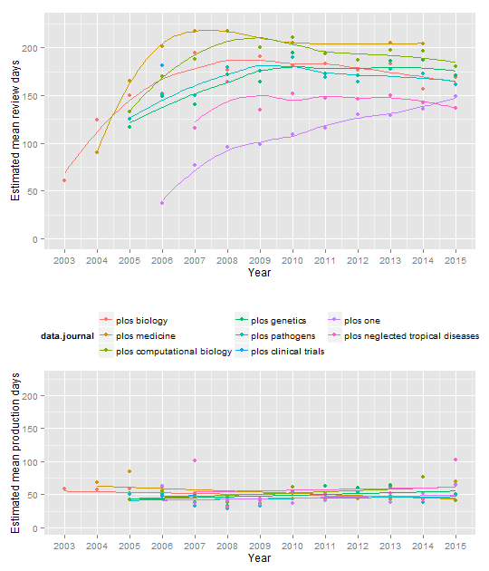

## Data cleaning

```r
setwd("D:/Dropbox/projects/2015lag/archive")

# Dependencies
library(stringr)
library(ggplot2)
library(knitr)
library(plyr)
source('multiplot.r')

# Read in data
dat <- read.csv(file = '20150704collected_data.csv')

# Assimilate journal naming
# See discrepancies
table(dat$data.journal)
```

```
## 
##                             none                     PLoS Biology 
##                             6632                             1947 
##                     PLOS Biology             PLoS Clinical Trials 
##                               71                               44 
##       PLoS Computational Biology       PLOS Computational Biology 
##                             3179                              247 
##                    PLoS Genetics                    PLOS Genetics 
##                             4373                              368 
##                     PLoS Medicin                    PLoS Medicine 
##                                1                             1031 
##                    PLOS Medicine PLoS Neglected Tropical Diseases 
##                               31                             2655 
## PLOS Neglected Tropical Diseases                         PLoS One 
##                              359                                1 
##                         PLoS ONE                         PLOS ONE 
##                           107911                            14502 
##                   PLoS Pathogens                   PLOS Pathogens 
##                             3683                              320
```

```r
# Most due to using PLoS and PLOS

# Solve this by making all journal names lowercase
dat$data.journal <- tolower(dat$data.journal)
table(dat$data.journal)
```

```
## 
##                             none                     plos biology 
##                             6632                             2018 
##             plos clinical trials       plos computational biology 
##                               44                             3426 
##                    plos genetics                     plos medicin 
##                             4741                                1 
##                    plos medicine plos neglected tropical diseases 
##                             1062                             3014 
##                         plos one                   plos pathogens 
##                           122414                             4003
```

```r
# plos medicin = typo
dat$data.journal[dat$data.journal == "plos medicin"] <- "plos medicine"

# remove the journals with "none"
dat <- dat[!dat$data.journal == "none", ]
table(dat$data.journal)
```

```
## 
##                     plos biology             plos clinical trials 
##                             2018                               44 
##       plos computational biology                    plos genetics 
##                             3426                             4741 
##                    plos medicine plos neglected tropical diseases 
##                             1063                             3014 
##                         plos one                   plos pathogens 
##                           122414                             4003
```

```r
# Making the dates readable
dat$received <- as.Date(substring(dat$data.received_date,
                                  first = 0,
                                  last = 10))
dat$accepted <- as.Date(substring(dat$data.accepted_date,
                                  first = 0,
                                  last = 10))
dat$published <- as.Date(substring(dat$data.publication_date,
                                   first = 0,
                                   last = 10))

# Listwise deletion
# Nr of rows deleted
dim(dat)[1] - sum(!is.na(dat$received) &
                    !is.na(dat$accepted) &
                    !is.na(dat$published))
```

```
## [1] 10
```

```r
dat <- dat[!is.na(dat$received) &
             !is.na(dat$accepted) &
             !is.na(dat$published), ]

# Adding a year variable based on year published
dat$year <- as.numeric(substring(dat$data.publication_date,
                                 first = 0,
                                 last = 4))

# Adding the number of authors on the paper
# By counting the separators + 1 (for initial author)
# E.g., A; B counts 1 semi-colon, + 1 = 2 authors
dat$authors <- str_count(string = dat$data.author, ";")

# Adding a dummy for competing interests
# 0 = "no competing interests"
# 1 = !"no competing interest"
dat$coi <- !grepl(pattern = "no competing interests",
                  dat$data.competing_interest)
```

## Date checking
The data was cleaned in several steps, but the data were also inspected for some illogical dates, where the paper was published before it was accepted (i.e., 2 cases) or accepted before received (i.e., 34 cases). Below I give the DOIs for those papers and eliminate them from the dataset.


```r
# Checking for illogical dates
# Published before accepted
as.matrix(dat$data.id[dat$published < dat$accepted])
```

```
##      [,1]                          
## [1,] "10.1371/journal.pone.0052595"
## [2,] "10.1371/journal.pone.0005466"
```

```r
dat <- dat[!dat$published < dat$accepted, ]

# Accepted before received
as.matrix(dat$data.id[dat$accepted < dat$received])
```

```
##       [,1]                          
##  [1,] "10.1371/journal.pntd.0003729"
##  [2,] "10.1371/journal.pmed.0040325"
##  [3,] "10.1371/journal.pbio.0030204"
##  [4,] "10.1371/journal.pbio.0030092"
##  [5,] "10.1371/journal.pbio.0040092"
##  [6,] "10.1371/journal.pone.0080696"
##  [7,] "10.1371/journal.pntd.0001618"
##  [8,] "10.1371/journal.pntd.0001819"
##  [9,] "10.1371/journal.pntd.0001741"
## [10,] "10.1371/journal.pntd.0002247"
## [11,] "10.1371/journal.pntd.0002177"
## [12,] "10.1371/journal.ppat.1004231"
## [13,] "10.1371/journal.pone.0098569"
## [14,] "10.1371/journal.ppat.1003643"
## [15,] "10.1371/journal.ppat.1003408"
## [16,] "10.1371/journal.ppat.1003411"
## [17,] "10.1371/journal.ppat.1003356"
## [18,] "10.1371/journal.ppat.1003330"
## [19,] "10.1371/journal.ppat.1003580"
## [20,] "10.1371/journal.ppat.1003454"
## [21,] "10.1371/journal.pntd.0002876"
## [22,] "10.1371/journal.pntd.0003002"
## [23,] "10.1371/journal.pntd.0002394"
## [24,] "10.1371/journal.pntd.0002230"
## [25,] "10.1371/journal.pone.0105900"
## [26,] "10.1371/journal.pntd.0002360"
## [27,] "10.1371/journal.pntd.0002219"
## [28,] "10.1371/journal.pntd.0002215"
## [29,] "10.1371/journal.pntd.0002196"
## [30,] "10.1371/journal.pntd.0002305"
## [31,] "10.1371/journal.pcbi.0020013"
## [32,] "10.1371/journal.pcbi.0020027"
## [33,] "10.1371/journal.ppat.1002754"
## [34,] "10.1371/journal.ppat.1004917"
```

```r
dat <- dat[!dat$accepted < dat$received, ]

# Selecting out those papers which have equivalent
# received - accepted
as.matrix(dat$data.id[dat$received == dat$accepted])
```

```
##      [,1]                          
## [1,] "10.1371/journal.pone.0031292"
## [2,] "10.1371/journal.ppat.0030027"
## [3,] "10.1371/journal.pone.0001311"
```

```r
dat <- dat[!dat$received == dat$accepted, ]

print(dim(dat)[1])
```

```
## [1] 140674
```

```r
print(table(dat$data.journal))
```

```
## 
##                     plos biology             plos clinical trials 
##                             2015                               44 
##       plos computational biology                    plos genetics 
##                             3423                             4741 
##                    plos medicine plos neglected tropical diseases 
##                             1062                             2999 
##                         plos one                   plos pathogens 
##                           122398                             3992
```
## Data prepping
### Computing days between received, accepted, and published
In order to actually conduct analyses on the publication lag, the dates for received-, accepted-, and published submission must be reformatted into difference data in days. The actual code running these computations is commented out to save time. The objects loaded in are saves from a previous run of the commented out code.


```r
# Calculating the days between received, accepted, and published
calc_days <- Vectorize(function(a, b) 
  length(seq(a, b, "days")) - 1)
# Minus 1 because otherwise count will be 1 for the same date

# received_accepted <- calc_days(dat$received, dat$accepted)
# save(received_accepted, file = "received_accepted")
# 
# accepted_published <- calc_days(dat$accepted, dat$ published)
# save(accepted_published, file = "accepted_published")
# 
# received_published <- calc_days(dat$received, dat$published)
# save(received_published, file = "received_published")

# Load the objects created in the commented out code above
# Decreases runtime
load("received_accepted")
dat$received_accepted <- received_accepted
load("accepted_published")
dat$accepted_published <- accepted_published
load("received_published")
dat$received_published <- received_published
```

## Data analysis
Prior to data analysis I stress once again that the data *is* the population of PLOS research articles and that making inferences based on p-value hypothesis testing therefore makes no sense. I will therefore eliminate all hypothesis testing statistics and limit myself to point estimates.

### Descriptives
The median full publication cycle is 152 days, with the majority of this being the review process (i.e., 111 days) and not the production process (i.e., 38 days). When we split this per journal, we see the following publication cycle.

```r
x <- ddply(.data = dat, .(data.journal),
           .fun = function(x) summary(x$received_published))
x[order(x$Median),]
```

```
##                       data.journal Min. 1st Qu. Median  Mean 3rd Qu. Max.
## 7                         plos one   14   113.0  147.0 163.6   194.0 1955
## 2             plos clinical trials   91   155.2  180.5 181.0   205.0  303
## 4                    plos genetics   30   142.0  182.0 195.8   232.0 1052
## 6 plos neglected tropical diseases   49   142.0  183.0 198.9   232.0 1187
## 8                   plos pathogens   23   145.0  183.0 196.0   230.0 1032
## 1                     plos biology   42   147.0  190.0 201.2   241.5  650
## 3       plos computational biology   65   161.0  199.0 214.8   248.0 1162
## 5                    plos medicine   33   189.0  230.5 246.0   285.0  883
```
which, when split up into the review process and production process looks as follows

```r
x <- ddply(.data = dat, .(data.journal),
           .fun = function(x) summary(x$received_accepted))
x[order(x$Median),]
```

```
##                       data.journal Min. 1st Qu. Median  Mean 3rd Qu. Max.
## 7                         plos one    1   75.00    107 123.6   152.0 1927
## 2             plos clinical trials   23   98.75    125 126.1   155.0  245
## 4                    plos genetics    2   93.00    131 144.9   179.0 1000
## 6 plos neglected tropical diseases   16   96.00    133 151.1   184.0 1149
## 8                   plos pathogens    5  101.00    139 151.4   184.0 1008
## 1                     plos biology    7   97.00    141 151.4   191.0  590
## 3       plos computational biology   13  111.00    148 162.8   196.0 1117
## 5                    plos medicine    8  137.00    176 191.8   226.8  823
```

```r
x <- ddply(.data = dat, .(data.journal),
           .fun = function(x) summary(x$accepted_published))
x[order(x$Median),]
```

```
##                       data.journal Min. 1st Qu. Median  Mean 3rd Qu. Max.
## 7                         plos one    0      29     36 39.98      46  758
## 8                   plos pathogens   11      32     43 44.63      52  225
## 6 plos neglected tropical diseases   10      36     45 47.81      55  216
## 1                     plos biology   15      41     46 49.78      55  422
## 5                    plos medicine    8      41     47 54.20      62  165
## 3       plos computational biology   22      38     48 52.03      59  258
## 4                    plos genetics   15      35     50 50.86      60  509
## 2             plos clinical trials   37      45     52 54.86      63   85
```
This indicates that the publication cycle is shortest for PLOS ONE, and longest for PLOS Medicine. This could be due to efficiency in handling more publications (i.e., ONE: 122398; Med.: 1062), but could also represent selectivity. PLOS ONE prouds itself of selecting papers only on scientific rigor and not on results, whereas PLOS medicine does include selectivity in its criteria for publication (e.g., originality of research; see their guidelines [here](http://journals.plos.org/plosmedicine/s/journal-information)).


```r
x <- ddply(dat, .(data.journal, year), function(x) summary(x$received_published))

ggplot(x, aes(x = year, y = Median, colour = data.journal)) +
  geom_point(aes(col = data.journal)) + 
  stat_smooth(method = "lm", se = FALSE) +
  labs(list(title = "Full publication cycle", x = "Median days", y = "Years")) +
  xlim(c(2003, 2015)) + 
  ylim(c(0, 225))
```

```
## Warning in loop_apply(n, do.ply): Removed 7 rows containing missing values
## (stat_smooth).
```

```
## Warning in loop_apply(n, do.ply): Removed 7 rows containing missing values
## (geom_point).
```

```
## Warning in loop_apply(n, do.ply): Removed 2 rows containing missing values
## (geom_path).
```

 

These plots indicate that publication cycles have increased in length, except for Neglected Tropical Diseases, which shows a decreasing trend. Clinical trials was only published in 2006 and 2007, after which it was discontinued and rolled into PLOS ONE. Considering that the review process and production process are substantively different, it makes sense to investigate whether these trends differ across these parts of the publication cycle.


```r
x <- ddply(dat, .(data.journal, year), function(x) summary(x$received_accepted))

p1 <- ggplot(x, aes(x = year, y = Median, colour = data.journal)) +
  geom_point(aes(col = data.journal)) + 
  stat_smooth(method = "lm", se = FALSE) +
  labs(list(title = "Review process", x = "Median days", y = "Years")) +
  xlim(c(2003, 2015)) + 
  ylim(c(0, 225)) + 
  theme(legend.position = "none") + 
  scale_x_continuous(breaks=2003:2015)
```

```
## Scale for 'x' is already present. Adding another scale for 'x', which will replace the existing scale.
```

```r
print(p1)
```

 

The trends for the review process seem highly similar to the overall. Considering that the review process takes up the largest part of the entire publication cycle (i.e., 111 days of the full 152 days), it makes sense that the trends for the full publication cycle are mostly made up of the trends in the review process.


```r
x <- ddply(dat, .(data.journal, year), function(x) summary(x$accepted_published))

p2 <- ggplot(x, aes(x = year, y = Median, colour = data.journal)) +
  geom_point(aes(col = data.journal)) + 
  stat_smooth(method = "lm", se = FALSE) +
  labs(list(title = "Production process", x = "Median days", y = "Years")) +
  xlim(c(2003, 2015)) + 
  ylim(c(0, 225)) + 
  theme(legend.position = "top") + 
  scale_x_continuous(breaks = 2003:2015)
```

```
## Scale for 'x' is already present. Adding another scale for 'x', which will replace the existing scale.
```

```r
print(p2)
```

 

However, when we look at the production process, we see that the trends are relatively stable or decreasing. This indicates that some of the PLOS journals have increased the efficiency of the production process, whereas others have not. 

From these analyses I conclude two things in analyzing publication cycles:

1. The year of the publication should be taken into account
2. Not all PLOS journals are alike, so inspect whether the overall trend is valid for the journals separately.

### Correlational data analysis
The correlation between the time to go from received to accepted and the time to go from accepted to published is 0.051. Note that competing interests is excluded from the correlation matrix because it is a dummy variable. Below the squared correlation matrix is given, for easier interpretation.


```r
d <- data.frame(receive_accept = as.numeric(received_accepted),
                accept_publish = as.numeric(accepted_published),
                receive_publish = as.numeric(received_published),
                authors = as.numeric(dat$authors),
                pages = as.numeric(dat$data.pagecount), 
                years = dat$year)
cor(d)
```

```
##                 receive_accept accept_publish receive_publish      authors
## receive_accept      1.00000000     0.05113354      0.97595530  0.014301905
## accept_publish      0.05113354     1.00000000      0.26758965  0.064943212
## receive_publish     0.97595530     0.26758965      1.00000000  0.027972671
## authors             0.01430191     0.06494321      0.02797267  1.000000000
## pages              -0.08647265    -0.06068832     -0.09667399 -0.040450711
## years               0.10771547     0.09830520      0.12537908  0.009836159
##                       pages        years
## receive_accept  -0.08647265  0.107715471
## accept_publish  -0.06068832  0.098305199
## receive_publish -0.09667399  0.125379083
## authors         -0.04045071  0.009836159
## pages            1.00000000 -0.087848795
## years           -0.08784880  1.000000000
```

```r
cor(d)^2
```

```
##                 receive_accept accept_publish receive_publish
## receive_accept    1.0000000000    0.002614638    0.9524887520
## accept_publish    0.0026146385    1.000000000    0.0716042217
## receive_publish   0.9524887520    0.071604222    1.0000000000
## authors           0.0002045445    0.004217621    0.0007824703
## pages             0.0074775191    0.003683072    0.0093458610
## years             0.0116026227    0.009663912    0.0157199145
##                       authors       pages         years
## receive_accept  0.00020454450 0.007477519 0.01160262273
## accept_publish  0.00421762080 0.003683072 0.00966391223
## receive_publish 0.00078247033 0.009345861 0.01571991454
## authors         1.00000000000 0.001636260 0.00009675002
## pages           0.00163626005 1.000000000 0.00771741087
## years           0.00009675002 0.007717411 1.00000000000
```

Here we see that squared correlations between the days from receive to accept and receive to published are high. This is logical because the majority of the publication cycle *is* the review process. The production process, on the other hand, has only a medium correlation with the entire publication cycle.

Other squared correlations are all small. The largest uncontrolled effect is 1% explained variance. Controlling for other explanatory variables is likely to have only little effect, because of low squared correlations between the explanatory variables.

This indicates the regression analyses will most likely indicate that the effects of the predictor variables will be small and the publication process will prove highly random in its duration.

### Linearity
Because correlations rest on the assumption of linearity, let us check the linearity to ensure that we are not jumping the gun with the previous section (should actually do this before but I forgot...)


```r
pairs(x = d[,-6])
```

 

The plots of the predictor variables on the publication variables indicate curvilinear relations. This means that a linear correlation is insufficient to model the relationship.

### Regression models
Before running the regression models, let me recapitulate what the previous analyses indicated:

1. Publication year as covariate
2. Analyze review process and production process separately
3. Linear and curvilinear estimates for predictor variables.
4. Check whether overall results hold for journals separately

Additionally, I will mean center the predictor variables `authors` and `pages` so intercept estimates are meaningful. All regression models will be Poisson regression, considering that number of days in each part of publication cycle is a count variable. Due to overdispersion in the data, Quasi-ML estimation will be used.


```r
dat$authors.centred <- as.numeric(dat$authors - mean(dat$authors, na.rm = TRUE))
dat$authors.centred.sq <- dat$authors.centred^2
dat$pages.centred <- as.numeric(dat$data.pagecount) - mean(as.numeric(dat$data.pagecount), na.rm = TRUE)
dat$pages.centred.sq <- dat$pages.centred^2

review_process <- glm(received_accepted ~ 
                        authors.centred +
                        authors.centred.sq + 
                        pages.centred + 
                        pages.centred.sq +
                        as.factor(year) + 
                        as.factor(coi),
                      data = dat,
                      family = "quasipoisson")

options(scipen = 5)
print(review_process)
```

```
## 
## Call:  glm(formula = received_accepted ~ authors.centred + authors.centred.sq + 
##     pages.centred + pages.centred.sq + as.factor(year) + as.factor(coi), 
##     family = "quasipoisson", data = dat)
## 
## Coefficients:
##         (Intercept)      authors.centred   authors.centred.sq  
##         4.183703551          0.001756108         -0.000005252  
##       pages.centred     pages.centred.sq  as.factor(year)2004  
##        -0.000835567         -0.000104159          0.687578055  
## as.factor(year)2005  as.factor(year)2006  as.factor(year)2007  
##         0.740309069          0.695788011          0.551037989  
## as.factor(year)2008  as.factor(year)2009  as.factor(year)2010  
##         0.622245463          0.595252347          0.660454511  
## as.factor(year)2011  as.factor(year)2012  as.factor(year)2013  
##         0.654626783          0.736873206          0.738873934  
## as.factor(year)2014  as.factor(year)2015   as.factor(coi)TRUE  
##         0.775322769          0.842292331         -0.017130485  
## 
## Degrees of Freedom: 140673 Total (i.e. Null);  140656 Residual
## Null Deviance:	    5830000 
## Residual Deviance: 5680000 	AIC: NA
```

```r
reviewdays <- exp(review_process$coefficients[1])
i = 2
for(j in 6:17){
  reviewdays[i] <- exp(review_process$coefficients[1] +
                         review_process$coefficients[j])
  i = i + 1}

production_process <- glm(accepted_published ~ 
                            authors.centred +
                            authors.centred.sq + 
                            pages.centred + 
                            pages.centred.sq +
                            as.factor(year) +
                            as.factor(coi),
                          data = dat,
                          family = "quasipoisson")

options(scipen = 5)
print(production_process)
```

```
## 
## Call:  glm(formula = accepted_published ~ authors.centred + authors.centred.sq + 
##     pages.centred + pages.centred.sq + as.factor(year) + as.factor(coi), 
##     family = "quasipoisson", data = dat)
## 
## Coefficients:
##         (Intercept)      authors.centred   authors.centred.sq  
##          4.24677469           0.00581845          -0.00001445  
##       pages.centred     pages.centred.sq  as.factor(year)2004  
##          0.00012486          -0.00010576           0.10155008  
## as.factor(year)2005  as.factor(year)2006  as.factor(year)2007  
##         -0.12891309          -0.10829864          -0.45996087  
## as.factor(year)2008  as.factor(year)2009  as.factor(year)2010  
##         -0.56911000          -0.56514208          -0.66265974  
## as.factor(year)2011  as.factor(year)2012  as.factor(year)2013  
##         -0.56665233          -0.47161252          -0.36991185  
## as.factor(year)2014  as.factor(year)2015   as.factor(coi)TRUE  
##         -0.53661168          -0.29642702           0.00550980  
## 
## Degrees of Freedom: 140673 Total (i.e. Null);  140656 Residual
## Null Deviance:	    861900 
## Residual Deviance: 772700 	AIC: NA
```

```r
productiondays <- exp(production_process$coefficients[1])
i = 2
for(j in 6:17){
  productiondays[i] <- exp(production_process$coefficients[1] +
                             production_process$coefficients[j])
  i = i + 1}

plotdf <- data.frame(years = 2003:2015, revdays = reviewdays,
                     proddays = productiondays)

p1 <- ggplot(plotdf, aes(x = years, y = revdays)) +
  geom_point() + 
  stat_smooth(method = "loess", se = FALSE) +
  labs(list(x = "Year", y = "Estimated review time")) + 
  theme(legend.position = "none") + 
  ylim(c(0, 250)) + 
  scale_x_continuous(breaks = 2003:2015)

p2 <- ggplot(plotdf, aes(x = years, y = proddays)) +
  geom_point() + 
  stat_smooth(method = "loess", se = FALSE) +
  labs(list(x = "Year", y = "Estimated production time")) + 
  theme(legend.position = "none") + 
  ylim(c(0, 250)) + 
  scale_x_continuous(breaks = 2003:2015)

multiplot(p1, p2 + guides(colour = guide_legend(nrow = 3)))
```

 


```r
x <- ddply(dat, .(year, data.journal), function(x){
  data.frame(revdays = x$received_accepted,
             proddays = x$accepted_published,
             year = x$year,
             coi = x$coi,
             authors.centred = x$authors.centred,
             authors.centred.sq = x$authors.centred.sq,
             pages.centred = x$pages.centred,
             pages.centred.sq = x$pages.centred.sq)
})

plotdf <- data.frame(data.journal = NULL,
                     years = NULL,
                     revdays = NULL,
                     proddays = NULL)

for(journal in unique(x$data.journal)){
  # Selecting the data for one journal
  sel <- x[x$data.journal == journal, ]
  
  # Estimating the model for the journal in the rev process
  review_process <- glm(revdays ~ 
                          authors.centred +
                          authors.centred.sq + 
                          pages.centred + 
                          pages.centred.sq +
                          as.factor(coi) +
                          as.factor(year),
                        data = sel,
                        family = "quasipoisson")
  print((review_process))
  
  # Calculating the estimated days of review in the model
  reviewdays <- exp(review_process$coefficients[1])
  i = 2
  for(j in 7 : length(review_process$coefficients)){
    reviewdays[i] <- exp(review_process$coefficients[1] +
                           review_process$coefficients[j])
    i = i + 1}
  
  # Estimating the days of production in the model
  production_process <- glm(proddays ~ 
                              authors.centred +
                              authors.centred.sq + 
                              pages.centred + 
                              pages.centred.sq +
                              as.factor(year) +
                              as.factor(coi),
                            data = sel,
                            family = "quasipoisson")
  
  print((production_process))
  # Calculating the estimates per year
  productiondays <- exp(production_process$coefficients[1])
  i = 2
  for(j in 7 : length(production_process$coefficients)){
    productiondays[i] <- exp(production_process$coefficients[1] +
                               production_process$coefficients[j])
    i = i + 1}
  
  temp <- data.frame(data.journal = journal,
                     years = unique(sel$year),
                     revdays = reviewdays,
                     proddays = productiondays)
  
  # Saving out the data
  plotdf <- rbind(plotdf, temp)
}
```

```
## 
## Call:  glm(formula = revdays ~ authors.centred + authors.centred.sq + 
##     pages.centred + pages.centred.sq + as.factor(coi) + as.factor(year), 
##     family = "quasipoisson", data = sel)
## 
## Coefficients:
##         (Intercept)      authors.centred   authors.centred.sq  
##          4.10866707           0.00177331          -0.00001157  
##       pages.centred     pages.centred.sq   as.factor(coi)TRUE  
##          0.00258629          -0.00015998           0.00685072  
## as.factor(year)2004  as.factor(year)2005  as.factor(year)2006  
##          0.71416647           0.90083747           0.91110409  
## as.factor(year)2007  as.factor(year)2008  as.factor(year)2009  
##          1.16190159           1.06405654           1.14383791  
## as.factor(year)2010  as.factor(year)2011  as.factor(year)2012  
##          1.09081214           1.10232131           1.06417914  
## as.factor(year)2013  as.factor(year)2014  as.factor(year)2015  
##          1.10273378           0.94374977           1.02285391  
## 
## Degrees of Freedom: 2014 Total (i.e. Null);  1997 Residual
## Null Deviance:	    73140 
## Residual Deviance: 65840 	AIC: NA
## 
## Call:  glm(formula = proddays ~ authors.centred + authors.centred.sq + 
##     pages.centred + pages.centred.sq + as.factor(year) + as.factor(coi), 
##     family = "quasipoisson", data = sel)
## 
## Coefficients:
##         (Intercept)      authors.centred   authors.centred.sq  
##          4.07497730          -0.00062518          -0.00001205  
##       pages.centred     pages.centred.sq  as.factor(year)2004  
##          0.00005036          -0.00003693           0.09565118  
## as.factor(year)2005  as.factor(year)2006  as.factor(year)2007  
##         -0.02919644          -0.00657952           0.03823947  
## as.factor(year)2008  as.factor(year)2009  as.factor(year)2010  
##         -0.24788400          -0.27162724          -0.31608039  
## as.factor(year)2011  as.factor(year)2012  as.factor(year)2013  
##         -0.29411259          -0.27385814          -0.31086342  
## as.factor(year)2014  as.factor(year)2015   as.factor(coi)TRUE  
##         -0.32487455          -0.33043809           0.10638313  
## 
## Degrees of Freedom: 2014 Total (i.e. Null);  1997 Residual
## Null Deviance:	    7714 
## Residual Deviance: 4605 	AIC: NA
## 
## Call:  glm(formula = revdays ~ authors.centred + authors.centred.sq + 
##     pages.centred + pages.centred.sq + as.factor(coi) + as.factor(year), 
##     family = "quasipoisson", data = sel)
## 
## Coefficients:
##         (Intercept)      authors.centred   authors.centred.sq  
##          4.49986616           0.00060374          -0.00002508  
##       pages.centred     pages.centred.sq   as.factor(coi)TRUE  
##          0.00092514          -0.00019599           0.03711171  
## as.factor(year)2005  as.factor(year)2006  as.factor(year)2007  
##          0.60828934           0.80585659           0.88039661  
## as.factor(year)2008  as.factor(year)2009  as.factor(year)2010  
##          0.91740208           1.12571231           0.82455794  
## as.factor(year)2011  as.factor(year)2012  as.factor(year)2013  
##          0.96283649           1.05903540           0.82279666  
## as.factor(year)2014  as.factor(year)2015  
##          0.81804255           0.95074201  
## 
## Degrees of Freedom: 1061 Total (i.e. Null);  1045 Residual
## Null Deviance:	    41190 
## Residual Deviance: 35640 	AIC: NA
## 
## Call:  glm(formula = proddays ~ authors.centred + authors.centred.sq + 
##     pages.centred + pages.centred.sq + as.factor(year) + as.factor(coi), 
##     family = "quasipoisson", data = sel)
## 
## Coefficients:
##         (Intercept)      authors.centred   authors.centred.sq  
##        4.2298827904         0.0001852515        -0.0000086756  
##       pages.centred     pages.centred.sq  as.factor(year)2005  
##        0.0005151049         0.0000005676        -0.0028305387  
## as.factor(year)2006  as.factor(year)2007  as.factor(year)2008  
##        0.2094690721        -0.2013928724        -0.2706354730  
## as.factor(year)2009  as.factor(year)2010  as.factor(year)2011  
##       -0.4032908824        -0.5092341632        -0.4448277517  
## as.factor(year)2012  as.factor(year)2013  as.factor(year)2014  
##       -0.4495859582        -0.4484683655        -0.4572485634  
## as.factor(year)2015   as.factor(coi)TRUE  
##       -0.4784239587         0.0084793422  
## 
## Degrees of Freedom: 1061 Total (i.e. Null);  1045 Residual
## Null Deviance:	    6481 
## Residual Deviance: 2476 	AIC: NA
## 
## Call:  glm(formula = revdays ~ authors.centred + authors.centred.sq + 
##     pages.centred + pages.centred.sq + as.factor(coi) + as.factor(year), 
##     family = "quasipoisson", data = sel)
## 
## Coefficients:
##         (Intercept)      authors.centred   authors.centred.sq  
##           4.8914924           -0.0028890           -0.0005406  
##       pages.centred     pages.centred.sq   as.factor(coi)TRUE  
##           0.0014486           -0.0003338            0.0051308  
## as.factor(year)2006  as.factor(year)2007  as.factor(year)2008  
##           0.2439238            0.3443658            0.4883147  
## as.factor(year)2009  as.factor(year)2010  as.factor(year)2011  
##           0.4094643            0.4599346            0.3734406  
## as.factor(year)2012  as.factor(year)2013  as.factor(year)2014  
##           0.3374606            0.3949113            0.3874732  
## as.factor(year)2015  
##           0.3013818  
## 
## Degrees of Freedom: 3422 Total (i.e. Null);  3407 Residual
## Null Deviance:	    119700 
## Residual Deviance: 114100 	AIC: NA
## 
## Call:  glm(formula = proddays ~ authors.centred + authors.centred.sq + 
##     pages.centred + pages.centred.sq + as.factor(year) + as.factor(coi), 
##     family = "quasipoisson", data = sel)
## 
## Coefficients:
##         (Intercept)      authors.centred   authors.centred.sq  
##           3.7405895            0.0015138            0.0004781  
##       pages.centred     pages.centred.sq  as.factor(year)2006  
##           0.0005832           -0.0001057            0.1807597  
## as.factor(year)2007  as.factor(year)2008  as.factor(year)2009  
##           0.2381107            0.1023842           -0.0842367  
## as.factor(year)2010  as.factor(year)2011  as.factor(year)2012  
##          -0.1512798            0.3746796            0.3899237  
## as.factor(year)2013  as.factor(year)2014  as.factor(year)2015  
##           0.3539366            0.3827273            0.5896703  
##  as.factor(coi)TRUE  
##          -0.0185663  
## 
## Degrees of Freedom: 3422 Total (i.e. Null);  3407 Residual
## Null Deviance:	    21910 
## Residual Deviance: 13240 	AIC: NA
## 
## Call:  glm(formula = revdays ~ authors.centred + authors.centred.sq + 
##     pages.centred + pages.centred.sq + as.factor(coi) + as.factor(year), 
##     family = "quasipoisson", data = sel)
## 
## Coefficients:
##         (Intercept)      authors.centred   authors.centred.sq  
##         4.763744548          0.000894070         -0.000006959  
##       pages.centred     pages.centred.sq   as.factor(coi)TRUE  
##         0.002052218         -0.000358041         -0.005621569  
## as.factor(year)2006  as.factor(year)2007  as.factor(year)2008  
##         0.238357800          0.180149065          0.384168398  
## as.factor(year)2009  as.factor(year)2010  as.factor(year)2011  
##         0.339667313          0.508655826          0.385337319  
## as.factor(year)2012  as.factor(year)2013  as.factor(year)2014  
##         0.374138694          0.461792124          0.465043023  
## as.factor(year)2015  
##         0.375792999  
## 
## Degrees of Freedom: 4740 Total (i.e. Null);  4725 Residual
## Null Deviance:	    177600 
## Residual Deviance: 167700 	AIC: NA
## 
## Call:  glm(formula = proddays ~ authors.centred + authors.centred.sq + 
##     pages.centred + pages.centred.sq + as.factor(year) + as.factor(coi), 
##     family = "quasipoisson", data = sel)
## 
## Coefficients:
##         (Intercept)      authors.centred   authors.centred.sq  
##         3.934552023          0.003060502         -0.000005389  
##       pages.centred     pages.centred.sq  as.factor(year)2006  
##         0.000409772         -0.000036107          0.037415541  
## as.factor(year)2007  as.factor(year)2008  as.factor(year)2009  
##        -0.022666138         -0.300702846         -0.466064755  
## as.factor(year)2010  as.factor(year)2011  as.factor(year)2012  
##        -0.400311956          0.050565673          0.206083706  
## as.factor(year)2013  as.factor(year)2014  as.factor(year)2015  
##         0.161725858          0.225986921         -0.159474036  
##  as.factor(coi)TRUE  
##        -0.005035780  
## 
## Degrees of Freedom: 4740 Total (i.e. Null);  4725 Residual
## Null Deviance:	    31830 
## Residual Deviance: 18480 	AIC: NA
## 
## Call:  glm(formula = revdays ~ authors.centred + authors.centred.sq + 
##     pages.centred + pages.centred.sq + as.factor(coi) + as.factor(year), 
##     family = "quasipoisson", data = sel)
## 
## Coefficients:
##         (Intercept)      authors.centred   authors.centred.sq  
##           4.8267055            0.0072880           -0.0004892  
##       pages.centred     pages.centred.sq   as.factor(coi)TRUE  
##           0.0001293           -0.0002764           -0.0627655  
## as.factor(year)2006  as.factor(year)2007  as.factor(year)2008  
##           0.1886836            0.1819362            0.3622486  
## as.factor(year)2009  as.factor(year)2010  as.factor(year)2011  
##           0.3384453            0.4198299            0.3015374  
## as.factor(year)2012  as.factor(year)2013  as.factor(year)2014  
##           0.2759437            0.3526464            0.3230529  
## as.factor(year)2015  
##           0.2557467  
## 
## Degrees of Freedom: 3991 Total (i.e. Null);  3976 Residual
## Null Deviance:	    135700 
## Residual Deviance: 130400 	AIC: NA
## 
## Call:  glm(formula = proddays ~ authors.centred + authors.centred.sq + 
##     pages.centred + pages.centred.sq + as.factor(year) + as.factor(coi), 
##     family = "quasipoisson", data = sel)
## 
## Coefficients:
##         (Intercept)      authors.centred   authors.centred.sq  
##          3.90899335           0.00173231           0.00007744  
##       pages.centred     pages.centred.sq  as.factor(year)2006  
##         -0.00007295           0.00001692          -0.12767050  
## as.factor(year)2007  as.factor(year)2008  as.factor(year)2009  
##         -0.01003259          -0.40767783          -0.55369399  
## as.factor(year)2010  as.factor(year)2011  as.factor(year)2012  
##         -0.42422062           0.08471489          -0.00610339  
## as.factor(year)2013  as.factor(year)2014  as.factor(year)2015  
##          0.07375146          -0.03146286          -0.27688196  
##  as.factor(coi)TRUE  
##         -0.01070774  
## 
## Degrees of Freedom: 3991 Total (i.e. Null);  3976 Residual
## Null Deviance:	    19200 
## Residual Deviance: 10720 	AIC: NA
## 
## Call:  glm(formula = revdays ~ authors.centred + authors.centred.sq + 
##     pages.centred + pages.centred.sq + as.factor(coi) + as.factor(year), 
##     family = "quasipoisson", data = sel)
## 
## Coefficients:
##         (Intercept)      authors.centred   authors.centred.sq  
##           5.1995376           -0.0035359           -0.0011178  
##       pages.centred     pages.centred.sq   as.factor(coi)TRUE  
##           0.0055243           -0.0006679            0.1123716  
## as.factor(year)2007  
##           0.3244059  
## 
## Degrees of Freedom: 43 Total (i.e. Null);  37 Residual
## Null Deviance:	    836.8 
## Residual Deviance: 609.4 	AIC: NA
## 
## Call:  glm(formula = proddays ~ authors.centred + authors.centred.sq + 
##     pages.centred + pages.centred.sq + as.factor(year) + as.factor(coi), 
##     family = "quasipoisson", data = sel)
## 
## Coefficients:
##         (Intercept)      authors.centred   authors.centred.sq  
##          3.85203822           0.00518373           0.00006744  
##       pages.centred     pages.centred.sq  as.factor(year)2007  
##         -0.00048511           0.00008162           0.13827046  
##  as.factor(coi)TRUE  
##          0.03280538  
## 
## Degrees of Freedom: 43 Total (i.e. Null);  37 Residual
## Null Deviance:	    96.94 
## Residual Deviance: 83.83 	AIC: NA
## 
## Call:  glm(formula = revdays ~ authors.centred + authors.centred.sq + 
##     pages.centred + pages.centred.sq + as.factor(coi) + as.factor(year), 
##     family = "quasipoisson", data = sel)
## 
## Coefficients:
##         (Intercept)      authors.centred   authors.centred.sq  
##         3.619677949          0.000419007          0.000003753  
##       pages.centred     pages.centred.sq   as.factor(coi)TRUE  
##        -0.000721168         -0.000049241         -0.008623506  
## as.factor(year)2007  as.factor(year)2008  as.factor(year)2009  
##         0.718423223          0.942470056          0.971213494  
## as.factor(year)2010  as.factor(year)2011  as.factor(year)2012  
##         1.075177940          1.135385421          1.244993409  
## as.factor(year)2013  as.factor(year)2014  as.factor(year)2015  
##         1.238589811          1.288369186          1.382372151  
## 
## Degrees of Freedom: 122397 Total (i.e. Null);  122383 Residual
## Null Deviance:	    5042000 
## Residual Deviance: 4822000 	AIC: NA
## 
## Call:  glm(formula = proddays ~ authors.centred + authors.centred.sq + 
##     pages.centred + pages.centred.sq + as.factor(year) + as.factor(coi), 
##     family = "quasipoisson", data = sel)
## 
## Coefficients:
##         (Intercept)      authors.centred   authors.centred.sq  
##          4.13901626           0.00575154          -0.00001670  
##       pages.centred     pages.centred.sq  as.factor(year)2007  
##          0.00045405          -0.00007901          -0.66365268  
## as.factor(year)2008  as.factor(year)2009  as.factor(year)2010  
##         -0.52455619          -0.44162708          -0.59198576  
## as.factor(year)2011  as.factor(year)2012  as.factor(year)2013  
##         -0.54497324          -0.42196674          -0.30335121  
## as.factor(year)2014  as.factor(year)2015   as.factor(coi)TRUE  
##         -0.48900642          -0.18806362           0.02161909  
## 
## Degrees of Freedom: 122397 Total (i.e. Null);  122383 Residual
## Null Deviance:	    720500 
## Residual Deviance: 634500 	AIC: NA
## 
## Call:  glm(formula = revdays ~ authors.centred + authors.centred.sq + 
##     pages.centred + pages.centred.sq + as.factor(coi) + as.factor(year), 
##     family = "quasipoisson", data = sel)
## 
## Coefficients:
##         (Intercept)      authors.centred   authors.centred.sq  
##          4.74789060           0.00542013          -0.00011709  
##       pages.centred     pages.centred.sq   as.factor(coi)TRUE  
##         -0.00052007           0.00004431           0.03875241  
## as.factor(year)2008  as.factor(year)2009  as.factor(year)2010  
##          0.35310430           0.15707669           0.27607344  
## as.factor(year)2011  as.factor(year)2012  as.factor(year)2013  
##          0.24456892           0.23670862           0.26040364  
## as.factor(year)2014  as.factor(year)2015  
##          0.21316609           0.16975219  
## 
## Degrees of Freedom: 2998 Total (i.e. Null);  2985 Residual
## Null Deviance:	    116500 
## Residual Deviance: 115200 	AIC: NA
## 
## Call:  glm(formula = proddays ~ authors.centred + authors.centred.sq + 
##     pages.centred + pages.centred.sq + as.factor(year) + as.factor(coi), 
##     family = "quasipoisson", data = sel)
## 
## Coefficients:
##         (Intercept)      authors.centred   authors.centred.sq  
##          4.61955197           0.00069150           0.00015788  
##       pages.centred     pages.centred.sq  as.factor(year)2008  
##         -0.00001902           0.00002267          -0.97743013  
## as.factor(year)2009  as.factor(year)2010  as.factor(year)2011  
##         -1.18379596          -0.91654444          -0.68387522  
## as.factor(year)2012  as.factor(year)2013  as.factor(year)2014  
##         -0.66636254          -0.78526177          -0.67768399  
## as.factor(year)2015   as.factor(coi)TRUE  
##         -0.88180587           0.00899117  
## 
## Degrees of Freedom: 2998 Total (i.e. Null);  2985 Residual
## Null Deviance:	    19130 
## Residual Deviance: 15300 	AIC: NA
```

```r
plotdf$data.journal <- as.factor(plotdf$data.journal)

p1 <- ggplot(plotdf, aes(x = years, y = revdays, colour = data.journal, group = data.journal)) +
  geom_point(aes(col = data.journal)) + 
  stat_smooth(method = "loess", se = FALSE) + 
  labs(list(x = "Year", y = "Estimated mean review days")) + 
  xlim(c(2003, 2015)) + 
  ylim(c(0, 225)) +
  theme(legend.position = "none") + 
  scale_x_continuous(breaks = 2003:2015)
```

```
## Scale for 'x' is already present. Adding another scale for 'x', which will replace the existing scale.
```

```r
# Loess curves kept giving errors here
# Use LM curves instead...
p2 <- ggplot(plotdf, aes(x = years, y = proddays, colour = data.journal, group = data.journal)) +
  geom_point(aes(col = data.journal)) + 
  stat_smooth(method = "lm", se = FALSE) + 
  labs(list(x = "Year", y = "Estimated mean production days")) + 
  xlim(c(2003, 2015)) + 
  ylim(c(0, 225)) + 
  theme(legend.position = "top") +
  scale_x_continuous(breaks = 2003:2015)
```

```
## Scale for 'x' is already present. Adding another scale for 'x', which will replace the existing scale.
```

```r
multiplot(p1, p2 + guides(colour = guide_legend(nrow = 3)))
```

```
## Warning in loop_apply(n, do.ply): Removed 5 rows containing missing values
## (stat_smooth).
```

```
## Warning in loop_apply(n, do.ply): Removed 1 rows containing missing values
## (stat_smooth).
```

```
## Warning in loop_apply(n, do.ply): Removed 6 rows containing missing values
## (geom_point).
```

 
