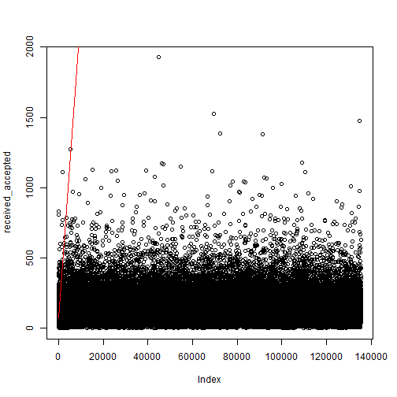

## Data cleaning

```r
setwd("D:/Dropbox/projects/2015lag/archive")

# Dependencies
library(stringr)
library(ggplot2)
library(knitr)
library(plyr)

# Read in data
dat <- read.csv(file = '20150514collected_data.csv')

# Assimilate journal naming
# See discrepancies
table(dat$data.journal)
```

```
## 
##                             none                     PLoS Biology 
##                             6632                             1947 
##                     PLOS Biology             PLoS Clinical Trials 
##                               56                               44 
##       PLoS Computational Biology       PLOS Computational Biology 
##                             3179                              180 
##                    PLoS Genetics                    PLOS Genetics 
##                             4373                              255 
##                     PLoS Medicin                    PLoS Medicine 
##                                1                             1031 
##                    PLOS Medicine PLoS Neglected Tropical Diseases 
##                               20                             2655 
## PLOS Neglected Tropical Diseases                         PLoS One 
##                              262                                1 
##                         PLoS ONE                         PLOS ONE 
##                           107911                             9653 
##                   PLoS Pathogens                   PLOS Pathogens 
##                             3683                              216
```

```r
# Most due to using PLoS and PLOS

# Solve this by making all journal names lowercase
dat$data.journal <- tolower(dat$data.journal)
table(dat$data.journal)
```

```
## 
##                             none                     plos biology 
##                             6632                             2003 
##             plos clinical trials       plos computational biology 
##                               44                             3359 
##                    plos genetics                     plos medicin 
##                             4628                                1 
##                    plos medicine plos neglected tropical diseases 
##                             1051                             2917 
##                         plos one                   plos pathogens 
##                           117565                             3899
```

```r
# plos medicin = typo
dat$data.journal[dat$data.journal == "plos medicin"] <- "plos medicine"

# remove the journals with "none"
dat <- dat[!dat$data.journal == "none", ]
table(dat$data.journal)
```

```
## 
##                     plos biology             plos clinical trials 
##                             2003                               44 
##       plos computational biology                    plos genetics 
##                             3359                             4628 
##                    plos medicine plos neglected tropical diseases 
##                             1052                             2917 
##                         plos one                   plos pathogens 
##                           117565                             3899
```

```r
# Making the dates readable
dat$received <- as.Date(substring(dat$data.received_date,
                                  first = 0,
                                  last = 10))
dat$accepted <- as.Date(substring(dat$data.accepted_date,
                                  first = 0,
                                  last = 10))
dat$published <- as.Date(substring(dat$data.publication_date,
                                   first = 0,
                                   last = 10))

# Listwise deletion
# Nr of rows deleted
dim(dat)[1] - sum(!is.na(dat$received) &
                    !is.na(dat$accepted) &
                    !is.na(dat$published))
```

```
## [1] 10
```

```r
dat <- dat[!is.na(dat$received) &
             !is.na(dat$accepted) &
             !is.na(dat$published), ]

# Adding a year variable based on year published
dat$year <- as.numeric(substring(dat$data.publication_date,
                                 first = 0,
                                 last = 4))

# Adding the number of authors on the paper
# By counting the separators + 1 (for initial author)
# E.g., A; B counts 1 semi-colon, + 1 = 2 authors
dat$authors <- str_count(string = dat$data.author, ";")

# Adding a dummy for competing interests
# 0 = "no competing interests"
# 1 = !"no competing interest"
dat$coi <- !grepl(pattern = "no competing interests",
                  dat$data.competing_interest)
```

## Date checking
The data was cleaned in several steps, but the data were also inspected for some illogical dates, where the paper was published before it was accepted (i.e., 2 cases) or accepted before received (i.e., 33 cases). Below I give the DOIs for those papers and eliminate them from the dataset.


```r
# Checking for illogical dates
# Published before accepted
as.matrix(dat$data.id[dat$published < dat$accepted])
```

```
##      [,1]                          
## [1,] "10.1371/journal.pone.0052595"
## [2,] "10.1371/journal.pone.0005466"
```

```r
dat <- dat[!dat$published < dat$accepted, ]

# Accepted before received
as.matrix(dat$data.id[dat$accepted < dat$received])
```

```
##       [,1]                          
##  [1,] "10.1371/journal.pntd.0003729"
##  [2,] "10.1371/journal.pmed.0040325"
##  [3,] "10.1371/journal.pbio.0030204"
##  [4,] "10.1371/journal.pbio.0030092"
##  [5,] "10.1371/journal.pbio.0040092"
##  [6,] "10.1371/journal.pone.0080696"
##  [7,] "10.1371/journal.pntd.0001618"
##  [8,] "10.1371/journal.pntd.0001819"
##  [9,] "10.1371/journal.pntd.0001741"
## [10,] "10.1371/journal.pntd.0002247"
## [11,] "10.1371/journal.pntd.0002177"
## [12,] "10.1371/journal.ppat.1004231"
## [13,] "10.1371/journal.pone.0098569"
## [14,] "10.1371/journal.ppat.1003643"
## [15,] "10.1371/journal.ppat.1003408"
## [16,] "10.1371/journal.ppat.1003411"
## [17,] "10.1371/journal.ppat.1003356"
## [18,] "10.1371/journal.ppat.1003330"
## [19,] "10.1371/journal.ppat.1003580"
## [20,] "10.1371/journal.ppat.1003454"
## [21,] "10.1371/journal.pntd.0002876"
## [22,] "10.1371/journal.pntd.0003002"
## [23,] "10.1371/journal.pntd.0002394"
## [24,] "10.1371/journal.pntd.0002230"
## [25,] "10.1371/journal.pone.0105900"
## [26,] "10.1371/journal.pntd.0002360"
## [27,] "10.1371/journal.pntd.0002219"
## [28,] "10.1371/journal.pntd.0002215"
## [29,] "10.1371/journal.pntd.0002196"
## [30,] "10.1371/journal.pntd.0002305"
## [31,] "10.1371/journal.pcbi.0020013"
## [32,] "10.1371/journal.pcbi.0020027"
## [33,] "10.1371/journal.ppat.1002754"
```

```r
dat <- dat[!dat$accepted < dat$received, ]
```
## Data prepping
### Computing days between received, accepted, and published
In order to actually conduct analyses on the publication lag, the dates for received-, accepted-, and published submission must be reformatted into difference data in days. The actual code running these computations is commented out to save time. The objects loaded in are saves from a previous run of the commented out code.


```r
# Calculating the days between received, accepted, and published
calc_days <- Vectorize(function(a, b) 
  length(seq(a, b, "days"))) 

# received_accepted <- calc_days(dat$received, dat$accepted)
# save(received_accepted, file = "received_accepted")
# 
# accepted_published <- calc_days(dat$accepted, dat$ published)
# save(accepted_published, file = "accepted_published")
# 
# received_published <- calc_days(dat$received, dat$published)
# save(received_published, file = "received_published")

# Load the objects created in the commented out code above
# Decreases runtime
load("received_accepted")
dat$received_accepted <- received_accepted
load("accepted_published")
dat$accepted_published <- accepted_published
load("received_published")
dat$received_published <- received_published
```

## Data analysis
Prior to data analysis I stress once again that the data *is* the population of PLOS research articles and that making inferences based on p-value hypothesis testing therefore makes no sense. I will therefore eliminate all hypothesis testing statistics and limit myself to point estimates.

### Descriptives
The median full publication cycle is 153 days, with the majority of this being the review process (i.e., 112 days) and not the production process (i.e., 39 days). When we split this per journal, we see the following publication cycle.

```
##                       data.journal Min. 1st Qu. Median  Mean 3rd Qu. Max.
## 7                         plos one   15   113.0  147.0 163.7     194 1956
## 2             plos clinical trials   92   156.2  181.5 182.0     206  304
## 4                    plos genetics   31   143.0  183.0 196.8     233 1053
## 6 plos neglected tropical diseases   50   145.0  185.0 200.6     234 1188
## 8                   plos pathogens   50   147.0  185.0 197.4     231 1033
## 1                     plos biology   43   148.0  191.0 201.9     240  651
## 3       plos computational biology   66   162.0  199.0 215.5     249 1163
## 5                    plos medicine   34   189.5  232.0 247.1     286  884
```
which, when split up into the review process and production process looks as follows

```
##                       data.journal Min. 1st Qu. Median  Mean 3rd Qu. Max.
## 7                         plos one    1   75.00    107 123.8   152.0 1928
## 2             plos clinical trials   24   99.75    126 127.1   156.0  246
## 4                    plos genetics    3   93.00    132 145.5   180.0 1001
## 6 plos neglected tropical diseases   17   98.00    135 152.2   185.0 1150
## 8                   plos pathogens    1  102.00    140 152.4   185.0 1009
## 1                     plos biology    8   97.00    142 152.0   191.2  591
## 3       plos computational biology   14  112.00    149 163.8   197.0 1118
## 5                    plos medicine    9  137.00    176 192.7   227.5  824
```

```
##                       data.journal Min. 1st Qu. Median  Mean 3rd Qu. Max.
## 7                         plos one    1      30     37 40.87      47  759
## 8                   plos pathogens   14      35     44 45.98      54  226
## 6 plos neglected tropical diseases   11      38     46 49.44      56  217
## 1                     plos biology   16      42     47 50.84      56  423
## 5                    plos medicine    9      42     48 55.34      64  166
## 3       plos computational biology   23      39     49 52.67      60  259
## 4                    plos genetics   17      37     51 52.22      61  510
## 2             plos clinical trials   38      46     53 55.86      64   86
```
This indicates that the publication cycle is shortest for PLOS ONE, and longest for PLOS Medicine. This could be due to efficiency in handling more publications (i.e., ONE: 117551; Med.: 1051), but could also represent selectivity. PLOS ONE prouds itself of selecting papers only on scientific rigor and not on results, whereas PLOS medicine does include selectivity in its criteria for publication (e.g., originality of research; see their guidelines [here](http://journals.plos.org/plosmedicine/s/journal-information)).

 

These plots indicate that publication cycles have increased in length, except for Neglected Tropical Diseases, which shows a decreasing trend. Clinical trials was only published in 2006 and 2007, after which it was discontinued and rolled into PLOS ONE. Considering that the review process and production process are substantively different, it makes sense to investigate whether these trends differ across these parts of the publication cycle.

 

The trends for the review process seem highly similar to the overall. Considering that the review process takes up the largest part of the entire publication cycle (i.e., 112 days of the full 153 days), it makes sense that the trends for the full publication cycle are mostly made up of the trends in the review process.

 

However, when we look at the production process, we see that the trends are relatively stable or decreasing. This indicates that some of the PLOS journals have increased the efficiency of the production process, whereas others have not. 

From these analyses I conclude two things in analyzing publication cycles:

1. The year of the publication should be taken into account
2. Not all PLOS journals are alike, so inspect whether the overall trend is valid for the journals separately.

### Correlational data analysis
The correlation between the time to go from received to accepted and the time to go from accepted to published is 0.049. Note that competing interests is excluded from the correlation matrix because it is a dummy variable. Below the squared correlation matrix is given, for easier interpretation.


```r
d <- data.frame(receive_accept = as.numeric(received_accepted),
                accept_publish = as.numeric(accepted_published),
                receive_publish = as.numeric(received_published),
                authors = as.numeric(dat$authors),
                pages = as.numeric(dat$data.pagecount), 
                years = dat$year)
cor(d)^2
```

```
##                 receive_accept accept_publish receive_publish      authors
## receive_accept    1.0000000000    0.002370601    0.9526938694 0.0002264097
## accept_publish    0.0023706007    1.000000000    0.0701005015 0.0045490508
## receive_publish   0.9526938694    0.070100502    1.0000000000 0.0008534703
## authors           0.0002264097    0.004549051    0.0008534703 1.0000000000
## pages             0.0071925442    0.003845470    0.0090979125 0.0017404394
## years             0.0105719431    0.010204915    0.0147054730 0.0001078640
##                       pages       years
## receive_accept  0.007192544 0.010571943
## accept_publish  0.003845470 0.010204915
## receive_publish 0.009097913 0.014705473
## authors         0.001740439 0.000107864
## pages           1.000000000 0.003796193
## years           0.003796193 1.000000000
```

Here we see that squared correlations between the days from receive to accept and receive to published are high. This is logical because the majority of the publication cycle *is* the review process. The publication process, on the other hand, has only a medium correlation with the entire publication cycle.

Other squared correlations are all small. The largest uncontrolled effect is 1% explained variance. Controlling for other explanatory variables is likely to have only little effect, because of low squared correlations between the explanatory variables.

This indicates the regression analyses will most likely indicate that the effects of the predictor variables will be small and the publication process will prove highly random in its duration.

### Linearity
Because correlations rest on the assumption of linearity, let us check the linearity to ensure that we are not jumping the gun with the previous section (should actually do this before but I forgot...)

 

The plots of the predictor variables on the publication variables indicate curvilinear relations. This means that a linear correlation is insufficient to model the relationship.

### Regression models
Before running the regression models, let me recapitulate what the previous analyses indicated:

1. Publication year as covariate
2. Analyze review process and production process separately
3. Linear and curvilinear estimates for predictor variables.
4. Check whether overall results hold for journals separately

Additionally, I will mean center the predictor variables `authors` and `pages` so intercept estimates are meaningful. All regression models will be Poisson regression, considering that number of days in each part of publication cycle is a count variable.


```r
authors.centred <- dat$authors - mean(dat$authors, na.rm = TRUE)
authors.centred.sq <- authors.centred^2
pages.centred <- as.numeric(dat$data.pagecount) - mean(as.numeric(dat$data.pagecount), na.rm = TRUE)
pages.centred.sq <- pages.centred^2

x <- glm(received_accepted ~ 
           authors.centred +
           authors.centred.sq + 
           pages.centred + 
           pages.centred.sq +
           as.factor(year),
         data = dat,
         family = "poisson")

options(scipen = 5)
summary(x)
```

```
## 
## Call:
## glm(formula = received_accepted ~ authors.centred + authors.centred.sq + 
##     pages.centred + pages.centred.sq + as.factor(year), family = "poisson", 
##     data = dat)
## 
## Deviance Residuals: 
##     Min       1Q   Median       3Q      Max  
## -16.003   -4.750   -1.497    2.518   86.170  
## 
## Coefficients:
##                          Estimate    Std. Error z value Pr(>|z|)    
## (Intercept)          4.1832660485  0.0232190092 180.166   <2e-16 ***
## authors.centred      0.0017108741  0.0000581236  29.435   <2e-16 ***
## authors.centred.sq  -0.0000059870  0.0000006749  -8.872   <2e-16 ***
## pages.centred       -0.0009987810  0.0000143412 -69.644   <2e-16 ***
## pages.centred.sq    -0.0001068563  0.0000013553 -78.842   <2e-16 ***
## as.factor(year)2004  0.6802956889  0.0241931620  28.119   <2e-16 ***
## as.factor(year)2005  0.7464103885  0.0236135034  31.609   <2e-16 ***
## as.factor(year)2006  0.7018668089  0.0233868816  30.011   <2e-16 ***
## as.factor(year)2007  0.5579958401  0.0232832534  23.966   <2e-16 ***
## as.factor(year)2008  0.6295166288  0.0232384557  27.089   <2e-16 ***
## as.factor(year)2009  0.6024306529  0.0232237338  25.940   <2e-16 ***
## as.factor(year)2010  0.6665509802  0.0232125300  28.715   <2e-16 ***
## as.factor(year)2011  0.6609368381  0.0232028451  28.485   <2e-16 ***
## as.factor(year)2012  0.7419988749  0.0232000649  31.983   <2e-16 ***
## as.factor(year)2013  0.7437852476  0.0231950227  32.067   <2e-16 ***
## as.factor(year)2014  0.7797326463  0.0231966648  33.614   <2e-16 ***
## as.factor(year)2015  0.8565695350  0.0232115145  36.903   <2e-16 ***
## ---
## Signif. codes:  0 '***' 0.001 '**' 0.01 '*' 0.05 '.' 0.1 ' ' 1
## 
## (Dispersion parameter for poisson family taken to be 1)
## 
##     Null deviance: 5529922  on 135421  degrees of freedom
## Residual deviance: 5392693  on 135405  degrees of freedom
## AIC: 6276676
## 
## Number of Fisher Scoring iterations: 5
```

The intercept estimate is much to low for the average case in the data, indicating something might be going on in the modelling process. Some assumption might not hold for this data. Let's investigate.

### Investigating potential modeling issues
 

The above plot shows the distribution in the data (thin line) and the distribution estimated by the model (wide line). This clearly indicates that the variance is underestimated in the model. 

Note that, in Poisson models, the mean equals the variance (i.e., $\mu=\sigma^2=\lambda$; dispersion = 1). If we inspect the days in the review process, its mean is 127.918 and its variance is 6329.317. In other words, the dispersion in the actual data is 49.479, which indicates severe overdispersion. If we input `family = "quasipoisson"` this solves the overdispersion, as it now is incorporated into the model. Doing this revealed to me that overdispersion only affects the standard errors of the estimates, so back to square one.


```r
plot(received_accepted)

x <- glm(received_accepted ~ 
        authors.centred +
        authors.centred.sq + 
        pages.centred + 
        pages.centred.sq +
        as.factor(year),
    data = dat)

int <- as.numeric(x$coefficients[1])
auth <- as.numeric(x$coefficients[2])
auth.sq <- as.numeric(x$coefficients[3])

curve(int +
        auth * x +
        auth.sq * x,
      add = TRUE,
      from = 1, to = 140000, col = "red")
```

 

```r
x$coefficients
```

```
##         (Intercept)     authors.centred  authors.centred.sq 
##       75.5575883548        0.2203535393       -0.0007234017 
##       pages.centred    pages.centred.sq as.factor(year)2004 
##       -0.1223823975       -0.0136653075       54.9631639436 
## as.factor(year)2005 as.factor(year)2006 as.factor(year)2007 
##       62.5524072995       56.9847324060       40.3297721431 
## as.factor(year)2008 as.factor(year)2009 as.factor(year)2010 
##       48.2664237775       45.1361135491       52.6018252564 
## as.factor(year)2011 as.factor(year)2012 as.factor(year)2013 
##       51.9535090914       61.9667380274       62.1995966301 
## as.factor(year)2014 as.factor(year)2015 
##       66.9367135973       78.4551859146
```
