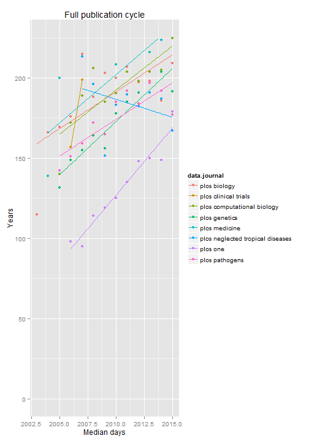
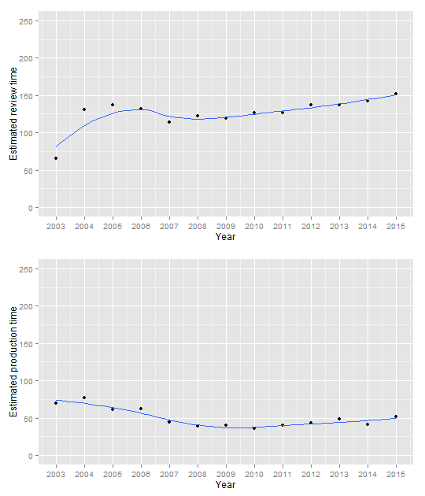

## Data cleaning

```r
setwd("D:/Dropbox/projects/2015lag/archive")

# Dependencies
library(stringr)
library(ggplot2)
library(knitr)
library(plyr)
source('multiplot.r')

# Read in data
dat <- read.csv(file = '20150514collected_data.csv')

# Assimilate journal naming
# See discrepancies
table(dat$data.journal)
```

```
## 
##                             none                     PLoS Biology 
##                             6632                             1947 
##                     PLOS Biology             PLoS Clinical Trials 
##                               56                               44 
##       PLoS Computational Biology       PLOS Computational Biology 
##                             3179                              180 
##                    PLoS Genetics                    PLOS Genetics 
##                             4373                              255 
##                     PLoS Medicin                    PLoS Medicine 
##                                1                             1031 
##                    PLOS Medicine PLoS Neglected Tropical Diseases 
##                               20                             2655 
## PLOS Neglected Tropical Diseases                         PLoS One 
##                              262                                1 
##                         PLoS ONE                         PLOS ONE 
##                           107911                             9653 
##                   PLoS Pathogens                   PLOS Pathogens 
##                             3683                              216
```

```r
# Most due to using PLoS and PLOS

# Solve this by making all journal names lowercase
dat$data.journal <- tolower(dat$data.journal)
table(dat$data.journal)
```

```
## 
##                             none                     plos biology 
##                             6632                             2003 
##             plos clinical trials       plos computational biology 
##                               44                             3359 
##                    plos genetics                     plos medicin 
##                             4628                                1 
##                    plos medicine plos neglected tropical diseases 
##                             1051                             2917 
##                         plos one                   plos pathogens 
##                           117565                             3899
```

```r
# plos medicin = typo
dat$data.journal[dat$data.journal == "plos medicin"] <- "plos medicine"

# remove the journals with "none"
dat <- dat[!dat$data.journal == "none", ]
table(dat$data.journal)
```

```
## 
##                     plos biology             plos clinical trials 
##                             2003                               44 
##       plos computational biology                    plos genetics 
##                             3359                             4628 
##                    plos medicine plos neglected tropical diseases 
##                             1052                             2917 
##                         plos one                   plos pathogens 
##                           117565                             3899
```

```r
# Making the dates readable
dat$received <- as.Date(substring(dat$data.received_date,
                                  first = 0,
                                  last = 10))
dat$accepted <- as.Date(substring(dat$data.accepted_date,
                                  first = 0,
                                  last = 10))
dat$published <- as.Date(substring(dat$data.publication_date,
                                   first = 0,
                                   last = 10))

# Listwise deletion
# Nr of rows deleted
dim(dat)[1] - sum(!is.na(dat$received) &
                    !is.na(dat$accepted) &
                    !is.na(dat$published))
```

```
## [1] 10
```

```r
dat <- dat[!is.na(dat$received) &
             !is.na(dat$accepted) &
             !is.na(dat$published), ]

# Adding a year variable based on year published
dat$year <- as.numeric(substring(dat$data.publication_date,
                                 first = 0,
                                 last = 4))

# Adding the number of authors on the paper
# By counting the separators + 1 (for initial author)
# E.g., A; B counts 1 semi-colon, + 1 = 2 authors
dat$authors <- str_count(string = dat$data.author, ";")

# Adding a dummy for competing interests
# 0 = "no competing interests"
# 1 = !"no competing interest"
dat$coi <- !grepl(pattern = "no competing interests",
                  dat$data.competing_interest)
```

## Date checking
The data was cleaned in several steps, but the data were also inspected for some illogical dates, where the paper was published before it was accepted (i.e., 2 cases) or accepted before received (i.e., 33 cases). Below I give the DOIs for those papers and eliminate them from the dataset.


```r
# Checking for illogical dates
# Published before accepted
as.matrix(dat$data.id[dat$published < dat$accepted])
```

```
##      [,1]                          
## [1,] "10.1371/journal.pone.0052595"
## [2,] "10.1371/journal.pone.0005466"
```

```r
dat <- dat[!dat$published < dat$accepted, ]

# Accepted before received
as.matrix(dat$data.id[dat$accepted < dat$received])
```

```
##       [,1]                          
##  [1,] "10.1371/journal.pntd.0003729"
##  [2,] "10.1371/journal.pmed.0040325"
##  [3,] "10.1371/journal.pbio.0030204"
##  [4,] "10.1371/journal.pbio.0030092"
##  [5,] "10.1371/journal.pbio.0040092"
##  [6,] "10.1371/journal.pone.0080696"
##  [7,] "10.1371/journal.pntd.0001618"
##  [8,] "10.1371/journal.pntd.0001819"
##  [9,] "10.1371/journal.pntd.0001741"
## [10,] "10.1371/journal.pntd.0002247"
## [11,] "10.1371/journal.pntd.0002177"
## [12,] "10.1371/journal.ppat.1004231"
## [13,] "10.1371/journal.pone.0098569"
## [14,] "10.1371/journal.ppat.1003643"
## [15,] "10.1371/journal.ppat.1003408"
## [16,] "10.1371/journal.ppat.1003411"
## [17,] "10.1371/journal.ppat.1003356"
## [18,] "10.1371/journal.ppat.1003330"
## [19,] "10.1371/journal.ppat.1003580"
## [20,] "10.1371/journal.ppat.1003454"
## [21,] "10.1371/journal.pntd.0002876"
## [22,] "10.1371/journal.pntd.0003002"
## [23,] "10.1371/journal.pntd.0002394"
## [24,] "10.1371/journal.pntd.0002230"
## [25,] "10.1371/journal.pone.0105900"
## [26,] "10.1371/journal.pntd.0002360"
## [27,] "10.1371/journal.pntd.0002219"
## [28,] "10.1371/journal.pntd.0002215"
## [29,] "10.1371/journal.pntd.0002196"
## [30,] "10.1371/journal.pntd.0002305"
## [31,] "10.1371/journal.pcbi.0020013"
## [32,] "10.1371/journal.pcbi.0020027"
## [33,] "10.1371/journal.ppat.1002754"
```

```r
dat <- dat[!dat$accepted < dat$received, ]
```
## Data prepping
### Computing days between received, accepted, and published
In order to actually conduct analyses on the publication lag, the dates for received-, accepted-, and published submission must be reformatted into difference data in days. The actual code running these computations is commented out to save time. The objects loaded in are saves from a previous run of the commented out code.


```r
# Calculating the days between received, accepted, and published
calc_days <- Vectorize(function(a, b) 
  length(seq(a, b, "days"))) 

# received_accepted <- calc_days(dat$received, dat$accepted)
# save(received_accepted, file = "received_accepted")
# 
# accepted_published <- calc_days(dat$accepted, dat$ published)
# save(accepted_published, file = "accepted_published")
# 
# received_published <- calc_days(dat$received, dat$published)
# save(received_published, file = "received_published")

# Load the objects created in the commented out code above
# Decreases runtime
load("received_accepted")
dat$received_accepted <- received_accepted
load("accepted_published")
dat$accepted_published <- accepted_published
load("received_published")
dat$received_published <- received_published
```

## Data analysis
Prior to data analysis I stress once again that the data *is* the population of PLOS research articles and that making inferences based on p-value hypothesis testing therefore makes no sense. I will therefore eliminate all hypothesis testing statistics and limit myself to point estimates.

### Descriptives
The median full publication cycle is 153 days, with the majority of this being the review process (i.e., 112 days) and not the production process (i.e., 39 days). When we split this per journal, we see the following publication cycle.

```
##                       data.journal Min. 1st Qu. Median  Mean 3rd Qu. Max.
## 7                         plos one   15   113.0  147.0 163.7     194 1956
## 2             plos clinical trials   92   156.2  181.5 182.0     206  304
## 4                    plos genetics   31   143.0  183.0 196.8     233 1053
## 6 plos neglected tropical diseases   50   145.0  185.0 200.6     234 1188
## 8                   plos pathogens   50   147.0  185.0 197.4     231 1033
## 1                     plos biology   43   148.0  191.0 201.9     240  651
## 3       plos computational biology   66   162.0  199.0 215.5     249 1163
## 5                    plos medicine   34   189.5  232.0 247.1     286  884
```
which, when split up into the review process and production process looks as follows

```
##                       data.journal Min. 1st Qu. Median  Mean 3rd Qu. Max.
## 7                         plos one    1   75.00    107 123.8   152.0 1928
## 2             plos clinical trials   24   99.75    126 127.1   156.0  246
## 4                    plos genetics    3   93.00    132 145.5   180.0 1001
## 6 plos neglected tropical diseases   17   98.00    135 152.2   185.0 1150
## 8                   plos pathogens    1  102.00    140 152.4   185.0 1009
## 1                     plos biology    8   97.00    142 152.0   191.2  591
## 3       plos computational biology   14  112.00    149 163.8   197.0 1118
## 5                    plos medicine    9  137.00    176 192.7   227.5  824
```

```
##                       data.journal Min. 1st Qu. Median  Mean 3rd Qu. Max.
## 7                         plos one    1      30     37 40.87      47  759
## 8                   plos pathogens   14      35     44 45.98      54  226
## 6 plos neglected tropical diseases   11      38     46 49.44      56  217
## 1                     plos biology   16      42     47 50.84      56  423
## 5                    plos medicine    9      42     48 55.34      64  166
## 3       plos computational biology   23      39     49 52.67      60  259
## 4                    plos genetics   17      37     51 52.22      61  510
## 2             plos clinical trials   38      46     53 55.86      64   86
```
This indicates that the publication cycle is shortest for PLOS ONE, and longest for PLOS Medicine. This could be due to efficiency in handling more publications (i.e., ONE: 117551; Med.: 1051), but could also represent selectivity. PLOS ONE prouds itself of selecting papers only on scientific rigor and not on results, whereas PLOS medicine does include selectivity in its criteria for publication (e.g., originality of research; see their guidelines [here](http://journals.plos.org/plosmedicine/s/journal-information)).


```
## Warning in loop_apply(n, do.ply): Removed 1 rows containing missing values
## (stat_smooth).
```

```
## Warning in loop_apply(n, do.ply): Removed 7 rows containing missing values
## (stat_smooth).
```

```
## Warning in loop_apply(n, do.ply): Removed 8 rows containing missing values
## (geom_point).
```

```
## Warning in loop_apply(n, do.ply): Removed 3 rows containing missing values
## (geom_path).
```

 

These plots indicate that publication cycles have increased in length, except for Neglected Tropical Diseases, which shows a decreasing trend. Clinical trials was only published in 2006 and 2007, after which it was discontinued and rolled into PLOS ONE. Considering that the review process and production process are substantively different, it makes sense to investigate whether these trends differ across these parts of the publication cycle.

 

The trends for the review process seem highly similar to the overall. Considering that the review process takes up the largest part of the entire publication cycle (i.e., 112 days of the full 153 days), it makes sense that the trends for the full publication cycle are mostly made up of the trends in the review process.

 

However, when we look at the production process, we see that the trends are relatively stable or decreasing. This indicates that some of the PLOS journals have increased the efficiency of the production process, whereas others have not. 

From these analyses I conclude two things in analyzing publication cycles:

1. The year of the publication should be taken into account
2. Not all PLOS journals are alike, so inspect whether the overall trend is valid for the journals separately.

### Correlational data analysis
The correlation between the time to go from received to accepted and the time to go from accepted to published is 0.049. Note that competing interests is excluded from the correlation matrix because it is a dummy variable. Below the squared correlation matrix is given, for easier interpretation.


```r
d <- data.frame(receive_accept = as.numeric(received_accepted),
                accept_publish = as.numeric(accepted_published),
                receive_publish = as.numeric(received_published),
                authors = as.numeric(dat$authors),
                pages = as.numeric(dat$data.pagecount), 
                years = dat$year)
cor(d)^2
```

```
##                 receive_accept accept_publish receive_publish      authors
## receive_accept    1.0000000000    0.002370601    0.9526938694 0.0002264097
## accept_publish    0.0023706007    1.000000000    0.0701005015 0.0045490508
## receive_publish   0.9526938694    0.070100502    1.0000000000 0.0008534703
## authors           0.0002264097    0.004549051    0.0008534703 1.0000000000
## pages             0.0071925442    0.003845470    0.0090979125 0.0017404394
## years             0.0105719431    0.010204915    0.0147054730 0.0001078640
##                       pages       years
## receive_accept  0.007192544 0.010571943
## accept_publish  0.003845470 0.010204915
## receive_publish 0.009097913 0.014705473
## authors         0.001740439 0.000107864
## pages           1.000000000 0.003796193
## years           0.003796193 1.000000000
```

Here we see that squared correlations between the days from receive to accept and receive to published are high. This is logical because the majority of the publication cycle *is* the review process. The production process, on the other hand, has only a medium correlation with the entire publication cycle.

Other squared correlations are all small. The largest uncontrolled effect is 1% explained variance. Controlling for other explanatory variables is likely to have only little effect, because of low squared correlations between the explanatory variables.

This indicates the regression analyses will most likely indicate that the effects of the predictor variables will be small and the publication process will prove highly random in its duration.

### Linearity
Because correlations rest on the assumption of linearity, let us check the linearity to ensure that we are not jumping the gun with the previous section (should actually do this before but I forgot...)

 

The plots of the predictor variables on the publication variables indicate curvilinear relations. This means that a linear correlation is insufficient to model the relationship.

### Regression models
Before running the regression models, let me recapitulate what the previous analyses indicated:

1. Publication year as covariate
2. Analyze review process and production process separately
3. Linear and curvilinear estimates for predictor variables.
4. Check whether overall results hold for journals separately

Additionally, I will mean center the predictor variables `authors` and `pages` so intercept estimates are meaningful. All regression models will be Poisson regression, considering that number of days in each part of publication cycle is a count variable. Due to overdispersion in the data, Quasi-ML estimation will be used.


```r
dat$authors.centred <- as.numeric(dat$authors - mean(dat$authors, na.rm = TRUE))
dat$authors.centred.sq <- dat$authors.centred^2
dat$pages.centred <- as.numeric(dat$data.pagecount) - mean(as.numeric(dat$data.pagecount), na.rm = TRUE)
dat$pages.centred.sq <- dat$pages.centred^2

review_process <- glm(received_accepted ~ 
                        authors.centred +
                        authors.centred.sq + 
                        pages.centred + 
                        pages.centred.sq +
                        as.factor(year) + 
                        as.factor(coi),
                      data = dat,
                      family = "quasipoisson")

options(scipen = 5)
summary(review_process)
```

```
## 
## Call:
## glm(formula = received_accepted ~ authors.centred + authors.centred.sq + 
##     pages.centred + pages.centred.sq + as.factor(year) + as.factor(coi), 
##     family = "quasipoisson", data = dat)
## 
## Deviance Residuals: 
##     Min       1Q   Median       3Q      Max  
## -16.025   -4.746   -1.499    2.517   86.133  
## 
## Coefficients:
##                         Estimate   Std. Error t value    Pr(>|t|)    
## (Intercept)          4.202754836  0.161322177  26.052     < 2e-16 ***
## authors.centred      0.001923272  0.000407255   4.723 0.000002332 ***
## authors.centred.sq  -0.000007136  0.000004724  -1.511    0.130900    
## pages.centred       -0.001000263  0.000099599 -10.043     < 2e-16 ***
## pages.centred.sq    -0.000106263  0.000009414 -11.288     < 2e-16 ***
## as.factor(year)2004  0.678791043  0.168013257   4.040 0.000053457 ***
## as.factor(year)2005  0.728153656  0.164051672   4.439 0.000009063 ***
## as.factor(year)2006  0.683833925  0.162476923   4.209 0.000025689 ***
## as.factor(year)2007  0.539623616  0.161759941   3.336    0.000850 ***
## as.factor(year)2008  0.610870621  0.161450932   3.784    0.000155 ***
## as.factor(year)2009  0.584060084  0.161346752   3.620    0.000295 ***
## as.factor(year)2010  0.648784953  0.161264727   4.023 0.000057467 ***
## as.factor(year)2011  0.643045969  0.161198358   3.989 0.000066343 ***
## as.factor(year)2012  0.724621258  0.161175534   4.496 0.000006935 ***
## as.factor(year)2013  0.726737412  0.161138313   4.510 0.000006488 ***
## as.factor(year)2014  0.762844723  0.161148653   4.734 0.000002206 ***
## as.factor(year)2015  0.839746662  0.161251315   5.208 0.000000191 ***
## as.factor(coi)TRUE  -0.020330227  0.005112503  -3.977 0.000069953 ***
## ---
## Signif. codes:  0 '***' 0.001 '**' 0.01 '*' 0.05 '.' 0.1 ' ' 1
## 
## (Dispersion parameter for quasipoisson family taken to be 48.22803)
## 
##     Null deviance: 5529922  on 135421  degrees of freedom
## Residual deviance: 5391927  on 135404  degrees of freedom
## AIC: NA
## 
## Number of Fisher Scoring iterations: 5
```

```r
reviewdays <- exp(review_process$coefficients[1])
i = 2
for(j in 6:17){
  reviewdays[i] <- exp(review_process$coefficients[1] +
                         review_process$coefficients[j])
  i = i + 1}

production_process <- glm(accepted_published ~ 
                            authors.centred +
                            authors.centred.sq + 
                            pages.centred + 
                            pages.centred.sq +
                            as.factor(year) +
                            as.factor(coi),
                          data = dat,
                          family = "quasipoisson")

options(scipen = 5)
summary(production_process)
```

```
## 
## Call:
## glm(formula = accepted_published ~ authors.centred + authors.centred.sq + 
##     pages.centred + pages.centred.sq + as.factor(year) + as.factor(coi), 
##     family = "quasipoisson", data = dat)
## 
## Deviance Residuals: 
##     Min       1Q   Median       3Q      Max  
## -11.392   -1.568   -0.536    0.767   55.532  
## 
## Coefficients:
##                         Estimate   Std. Error t value Pr(>|t|)    
## (Intercept)          4.263859900  0.057894686  73.649  < 2e-16 ***
## authors.centred      0.005867805  0.000260488  22.526  < 2e-16 ***
## authors.centred.sq  -0.000014744  0.000002573  -5.731 1.00e-08 ***
## pages.centred        0.000001625  0.000066165   0.025 0.980403    
## pages.centred.sq    -0.000109451  0.000006221 -17.595  < 2e-16 ***
## as.factor(year)2004  0.100073341  0.061951504   1.615 0.106237    
## as.factor(year)2005 -0.128099073  0.060160406  -2.129 0.033232 *  
## as.factor(year)2006 -0.107996267  0.058772927  -1.838 0.066136 .  
## as.factor(year)2007 -0.452214543  0.058302939  -7.756 8.81e-15 ***
## as.factor(year)2008 -0.559082591  0.058052643  -9.631  < 2e-16 ***
## as.factor(year)2009 -0.555282713  0.057917913  -9.587  < 2e-16 ***
## as.factor(year)2010 -0.650061124  0.057849662 -11.237  < 2e-16 ***
## as.factor(year)2011 -0.556643305  0.057747329  -9.639  < 2e-16 ***
## as.factor(year)2012 -0.463963262  0.057717889  -8.038 9.17e-16 ***
## as.factor(year)2013 -0.364490663  0.057667760  -6.321 2.61e-10 ***
## as.factor(year)2014 -0.527439554  0.057688994  -9.143  < 2e-16 ***
## as.factor(year)2015 -0.223024734  0.057798998  -3.859 0.000114 ***
## as.factor(coi)TRUE   0.003706212  0.003344927   1.108 0.267860    
## ---
## Signif. codes:  0 '***' 0.001 '**' 0.01 '*' 0.05 '.' 0.1 ' ' 1
## 
## (Dispersion parameter for quasipoisson family taken to be 6.948528)
## 
##     Null deviance: 800176  on 135421  degrees of freedom
## Residual deviance: 704021  on 135404  degrees of freedom
## AIC: NA
## 
## Number of Fisher Scoring iterations: 4
```

```r
productiondays <- exp(production_process$coefficients[1])
i = 2
for(j in 6:17){
  productiondays[i] <- exp(production_process$coefficients[1] +
                             production_process$coefficients[j])
  i = i + 1}

plotdf <- data.frame(years = 2003:2015, revdays = reviewdays,
                     proddays = productiondays)

p1 <- ggplot(plotdf, aes(x = years, y = revdays)) +
  geom_point() + 
  stat_smooth(method = "loess", se = FALSE) +
  labs(list(x = "Year", y = "Days to review"))

p2 <- ggplot(plotdf, aes(x = years, y = proddays)) +
  geom_point() + 
  stat_smooth(method = "loess", se = FALSE) +
  labs(list(x = "Year", y = "Production days"))

multiplot(p1, p2)
```

 


```
## 
## Call:
## glm(formula = revdays ~ authors.centred + authors.centred.sq + 
##     pages.centred + pages.centred.sq + as.factor(coi) + as.factor(year), 
##     family = "quasipoisson", data = sel)
## 
## Deviance Residuals: 
##      Min        1Q    Median        3Q       Max  
## -14.1971   -4.4069   -0.8493    2.7117   30.9972  
## 
## Coefficients:
##                        Estimate  Std. Error t value Pr(>|t|)    
## (Intercept)          4.13313818  0.16245374  25.442  < 2e-16 ***
## authors.centred      0.00184880  0.00233866   0.791   0.4293    
## authors.centred.sq  -0.00001224  0.00002385  -0.513   0.6078    
## pages.centred        0.00238698  0.00093755   2.546   0.0110 *  
## pages.centred.sq    -0.00016332  0.00007207  -2.266   0.0235 *  
## as.factor(coi)TRUE   0.00034405  0.05602650   0.006   0.9951    
## as.factor(year)2004  0.70500481  0.14470624   4.872 1.19e-06 ***
## as.factor(year)2005  0.88437344  0.15289234   5.784 8.44e-09 ***
## as.factor(year)2006  0.89438322  0.15415252   5.802 7.61e-09 ***
## as.factor(year)2007  1.14341509  0.15538356   7.359 2.71e-13 ***
## as.factor(year)2008  1.04591341  0.15594894   6.707 2.59e-11 ***
## as.factor(year)2009  1.12517232  0.15685693   7.173 1.03e-12 ***
## as.factor(year)2010  1.07231553  0.15712374   6.825 1.17e-11 ***
## as.factor(year)2011  1.08366039  0.15778772   6.868 8.69e-12 ***
## as.factor(year)2012  1.04583314  0.15962809   6.552 7.23e-11 ***
## as.factor(year)2013  1.08390817  0.15835979   6.845 1.02e-11 ***
## as.factor(year)2014  0.92577398  0.16028957   5.776 8.88e-09 ***
## as.factor(year)2015  0.93660069  0.17014870   5.505 4.18e-08 ***
## ---
## Signif. codes:  0 '***' 0.001 '**' 0.01 '*' 0.05 '.' 0.1 ' ' 1
## 
## (Dispersion parameter for quasipoisson family taken to be 35.58688)
## 
##     Null deviance: 72027  on 1999  degrees of freedom
## Residual deviance: 64843  on 1982  degrees of freedom
## AIC: NA
## 
## Number of Fisher Scoring iterations: 4
## 
## 
## Call:
## glm(formula = proddays ~ authors.centred + authors.centred.sq + 
##     pages.centred + pages.centred.sq + as.factor(year) + as.factor(coi), 
##     family = "quasipoisson", data = sel)
## 
## Deviance Residuals: 
##     Min       1Q   Median       3Q      Max  
## -7.8143  -0.5216  -0.1623   0.5214  28.9121  
## 
## Coefficients:
##                        Estimate  Std. Error t value      Pr(>|t|)    
## (Intercept)          4.08893130  0.05695576  71.791       < 2e-16 ***
## authors.centred     -0.00053860  0.00117299  -0.459        0.6462    
## authors.centred.sq  -0.00001236  0.00001217  -1.016        0.3099    
## pages.centred        0.00002587  0.00048725   0.053        0.9577    
## pages.centred.sq    -0.00003937  0.00003810  -1.034        0.3015    
## as.factor(year)2004  0.09450490  0.04049484   2.334        0.0197 *  
## as.factor(year)2005 -0.02475224  0.04809731  -0.515        0.6069    
## as.factor(year)2006 -0.00231290  0.04911957  -0.047        0.9624    
## as.factor(year)2007  0.04153093  0.05079000   0.818        0.4136    
## as.factor(year)2008 -0.23922947  0.05174336  -4.623 0.00000401874 ***
## as.factor(year)2009 -0.26249693  0.05273315  -4.978 0.00000069858 ***
## as.factor(year)2010 -0.30600584  0.05292961  -5.781 0.00000000859 ***
## as.factor(year)2011 -0.28444434  0.05351532  -5.315 0.00000011854 ***
## as.factor(year)2012 -0.26490827  0.05491092  -4.824 0.00000151196 ***
## as.factor(year)2013 -0.30094864  0.05396099  -5.577 0.00000002780 ***
## as.factor(year)2014 -0.31454156  0.05500969  -5.718 0.00000001242 ***
## as.factor(year)2015 -0.31727889  0.06318833  -5.021 0.00000055957 ***
## as.factor(coi)TRUE   0.10869546  0.02680234   4.055 0.00005197562 ***
## ---
## Signif. codes:  0 '***' 0.001 '**' 0.01 '*' 0.05 '.' 0.1 ' ' 1
## 
## (Dispersion parameter for quasipoisson family taken to be 2.928042)
## 
##     Null deviance: 7545.6  on 1999  degrees of freedom
## Residual deviance: 4513.0  on 1982  degrees of freedom
## AIC: NA
## 
## Number of Fisher Scoring iterations: 4
## 
## 
## Call:
## glm(formula = revdays ~ authors.centred + authors.centred.sq + 
##     pages.centred + pages.centred.sq + as.factor(coi) + as.factor(year), 
##     family = "quasipoisson", data = sel)
## 
## Deviance Residuals: 
##     Min       1Q   Median       3Q      Max  
## -15.419   -4.094   -1.045    2.402   33.458  
## 
## Coefficients:
##                        Estimate  Std. Error t value     Pr(>|t|)    
## (Intercept)          4.51273536  0.21194338  21.292      < 2e-16 ***
## authors.centred      0.00044143  0.00263638   0.167      0.86706    
## authors.centred.sq  -0.00002447  0.00003808  -0.643      0.52061    
## pages.centred        0.00063319  0.00099828   0.634      0.52603    
## pages.centred.sq    -0.00019917  0.00008769  -2.271      0.02333 *  
## as.factor(coi)TRUE   0.03228711  0.03130201   1.031      0.30256    
## as.factor(year)2005  0.60179970  0.20523636   2.932      0.00344 ** 
## as.factor(year)2006  0.79821567  0.20159108   3.960 0.0000802211 ***
## as.factor(year)2007  0.87230940  0.20275794   4.302 0.0000185123 ***
## as.factor(year)2008  0.90853683  0.20379523   4.458 0.0000091725 ***
## as.factor(year)2009  1.11617696  0.20434555   5.462 0.0000000589 ***
## as.factor(year)2010  0.81715189  0.20592810   3.968 0.0000774348 ***
## as.factor(year)2011  0.95396769  0.20438528   4.667 0.0000034494 ***
## as.factor(year)2012  1.04937625  0.20641727   5.084 0.0000004390 ***
## as.factor(year)2013  0.81475151  0.20592914   3.956 0.0000812574 ***
## as.factor(year)2014  0.81053977  0.20644155   3.926 0.0000919976 ***
## as.factor(year)2015  0.99598081  0.22419078   4.443 0.0000098469 ***
## ---
## Signif. codes:  0 '***' 0.001 '**' 0.01 '*' 0.05 '.' 0.1 ' ' 1
## 
## (Dispersion parameter for quasipoisson family taken to be 37.90384)
## 
##     Null deviance: 40757  on 1050  degrees of freedom
## Residual deviance: 35211  on 1034  degrees of freedom
## AIC: NA
## 
## Number of Fisher Scoring iterations: 4
## 
## 
## Call:
## glm(formula = proddays ~ authors.centred + authors.centred.sq + 
##     pages.centred + pages.centred.sq + as.factor(year) + as.factor(coi), 
##     family = "quasipoisson", data = sel)
## 
## Deviance Residuals: 
##     Min       1Q   Median       3Q      Max  
## -8.0464  -0.6958  -0.2494   0.6445   7.7857  
## 
## Coefficients:
##                         Estimate   Std. Error t value Pr(>|t|)    
## (Intercept)          4.242402385  0.062901669  67.445  < 2e-16 ***
## authors.centred      0.000171478  0.001264152   0.136 0.892127    
## authors.centred.sq  -0.000008690  0.000018276  -0.476 0.634514    
## pages.centred        0.000488803  0.000486554   1.005 0.315314    
## pages.centred.sq     0.000003567  0.000043209   0.083 0.934219    
## as.factor(year)2005 -0.002821091  0.054228344  -0.052 0.958521    
## as.factor(year)2006  0.206993098  0.052784808   3.921 9.38e-05 ***
## as.factor(year)2007 -0.197900577  0.054845710  -3.608 0.000323 ***
## as.factor(year)2008 -0.265944560  0.055993528  -4.750 2.33e-06 ***
## as.factor(year)2009 -0.395838693  0.058104825  -6.812 1.63e-11 ***
## as.factor(year)2010 -0.499407421  0.058513609  -8.535  < 2e-16 ***
## as.factor(year)2011 -0.436473454  0.057355324  -7.610 6.15e-14 ***
## as.factor(year)2012 -0.441014571  0.059926920  -7.359 3.77e-13 ***
## as.factor(year)2013 -0.439751905  0.058147198  -7.563 8.69e-14 ***
## as.factor(year)2014 -0.448098032  0.058641476  -7.641 4.89e-14 ***
## as.factor(year)2015 -0.442446948  0.077105582  -5.738 1.26e-08 ***
## as.factor(coi)TRUE   0.007899917  0.014811304   0.533 0.593892    
## ---
## Signif. codes:  0 '***' 0.001 '**' 0.01 '*' 0.05 '.' 0.1 ' ' 1
## 
## (Dispersion parameter for quasipoisson family taken to be 2.353296)
## 
##     Null deviance: 6328.8  on 1050  degrees of freedom
## Residual deviance: 2432.6  on 1034  degrees of freedom
## AIC: NA
## 
## Number of Fisher Scoring iterations: 4
## 
## 
## Call:
## glm(formula = revdays ~ authors.centred + authors.centred.sq + 
##     pages.centred + pages.centred.sq + as.factor(coi) + as.factor(year), 
##     family = "quasipoisson", data = sel)
## 
## Deviance Residuals: 
##     Min       1Q   Median       3Q      Max  
## -16.244   -4.298   -1.130    2.526   45.688  
## 
## Coefficients:
##                        Estimate  Std. Error t value Pr(>|t|)    
## (Intercept)          4.90823977  0.09095096  53.966  < 2e-16 ***
## authors.centred     -0.00305860  0.00333241  -0.918 0.358772    
## authors.centred.sq  -0.00053297  0.00041464  -1.285 0.198751    
## pages.centred        0.00115840  0.00063128   1.835 0.066592 .  
## pages.centred.sq    -0.00035486  0.00004951  -7.167 9.36e-13 ***
## as.factor(coi)TRUE  -0.00509721  0.05228081  -0.097 0.922338    
## as.factor(year)2006  0.24147082  0.09532457   2.533 0.011350 *  
## as.factor(year)2007  0.34107287  0.09093407   3.751 0.000179 ***
## as.factor(year)2008  0.48326330  0.08885694   5.439 5.75e-08 ***
## as.factor(year)2009  0.40511760  0.08806978   4.600 4.38e-06 ***
## as.factor(year)2010  0.45537895  0.08735182   5.213 1.97e-07 ***
## as.factor(year)2011  0.36893248  0.08777421   4.203 2.70e-05 ***
## as.factor(year)2012  0.33349361  0.08825673   3.779 0.000160 ***
## as.factor(year)2013  0.39055897  0.08687688   4.496 7.17e-06 ***
## as.factor(year)2014  0.38279386  0.08696402   4.402 1.11e-05 ***
## as.factor(year)2015  0.31187230  0.09292883   3.356 0.000800 ***
## ---
## Signif. codes:  0 '***' 0.001 '**' 0.01 '*' 0.05 '.' 0.1 ' ' 1
## 
## (Dispersion parameter for quasipoisson family taken to be 38.63916)
## 
##     Null deviance: 116908  on 3355  degrees of freedom
## Residual deviance: 111183  on 3340  degrees of freedom
## AIC: NA
## 
## Number of Fisher Scoring iterations: 4
## 
## 
## Call:
## glm(formula = proddays ~ authors.centred + authors.centred.sq + 
##     pages.centred + pages.centred.sq + as.factor(year) + as.factor(coi), 
##     family = "quasipoisson", data = sel)
## 
## Deviance Residuals: 
##     Min       1Q   Median       3Q      Max  
## -5.7463  -1.1246  -0.2623   0.6218  18.6061  
## 
## Coefficients:
##                       Estimate Std. Error t value Pr(>|t|)    
## (Intercept)          3.7595364  0.0482742  77.879  < 2e-16 ***
## authors.centred      0.0004209  0.0018561   0.227 0.820602    
## authors.centred.sq   0.0005294  0.0001756   3.015 0.002591 ** 
## pages.centred        0.0004174  0.0003590   1.163 0.244967    
## pages.centred.sq    -0.0001055  0.0000284  -3.715 0.000207 ***
## as.factor(year)2006  0.1765973  0.0502488   3.514 0.000446 ***
## as.factor(year)2007  0.2324565  0.0479479   4.848 1.30e-06 ***
## as.factor(year)2008  0.0994981  0.0476521   2.088 0.036872 *  
## as.factor(year)2009 -0.0825066  0.0473435  -1.743 0.081474 .  
## as.factor(year)2010 -0.1473957  0.0470707  -3.131 0.001755 ** 
## as.factor(year)2011  0.3669547  0.0458889   7.997 1.75e-15 ***
## as.factor(year)2012  0.3819604  0.0460332   8.298  < 2e-16 ***
## as.factor(year)2013  0.3468380  0.0454626   7.629 3.06e-14 ***
## as.factor(year)2014  0.3751057  0.0454915   8.246 2.33e-16 ***
## as.factor(year)2015  0.6011130  0.0482946  12.447  < 2e-16 ***
## as.factor(coi)TRUE  -0.0160718  0.0297077  -0.541 0.588545    
## ---
## Signif. codes:  0 '***' 0.001 '**' 0.01 '*' 0.05 '.' 0.1 ' ' 1
## 
## (Dispersion parameter for quasipoisson family taken to be 4.042945)
## 
##     Null deviance: 20035  on 3355  degrees of freedom
## Residual deviance: 11883  on 3340  degrees of freedom
## AIC: NA
## 
## Number of Fisher Scoring iterations: 4
## 
## 
## Call:
## glm(formula = revdays ~ authors.centred + authors.centred.sq + 
##     pages.centred + pages.centred.sq + as.factor(coi) + as.factor(year), 
##     family = "quasipoisson", data = sel)
## 
## Deviance Residuals: 
##     Min       1Q   Median       3Q      Max  
## -16.757   -4.376   -1.105    2.631   46.221  
## 
## Coefficients:
##                         Estimate   Std. Error t value Pr(>|t|)    
## (Intercept)          4.770070149  0.092865924  51.365  < 2e-16 ***
## authors.centred      0.000903944  0.000977373   0.925 0.355081    
## authors.centred.sq  -0.000006853  0.000007098  -0.965 0.334407    
## pages.centred        0.001570726  0.000648108   2.424 0.015408 *  
## pages.centred.sq    -0.000362693  0.000049433  -7.337 2.57e-13 ***
## as.factor(coi)TRUE  -0.009032030  0.039163732  -0.231 0.817618    
## as.factor(year)2006  0.236929523  0.095617964   2.478 0.013252 *  
## as.factor(year)2007  0.179189708  0.094360800   1.899 0.057629 .  
## as.factor(year)2008  0.381036878  0.090305756   4.219 2.50e-05 ***
## as.factor(year)2009  0.336903279  0.089312757   3.772 0.000164 ***
## as.factor(year)2010  0.504699871  0.088766413   5.686 1.38e-08 ***
## as.factor(year)2011  0.382253750  0.088886172   4.300 1.74e-05 ***
## as.factor(year)2012  0.371046926  0.089013807   4.168 3.12e-05 ***
## as.factor(year)2013  0.458060259  0.087956213   5.208 1.99e-07 ***
## as.factor(year)2014  0.461364946  0.088194117   5.231 1.76e-07 ***
## as.factor(year)2015  0.371036941  0.094154963   3.941 8.24e-05 ***
## ---
## Signif. codes:  0 '***' 0.001 '**' 0.01 '*' 0.05 '.' 0.1 ' ' 1
## 
## (Dispersion parameter for quasipoisson family taken to be 39.60844)
## 
##     Null deviance: 171169  on 4627  degrees of freedom
## Residual deviance: 161686  on 4612  degrees of freedom
## AIC: NA
## 
## Number of Fisher Scoring iterations: 4
## 
## 
## Call:
## glm(formula = proddays ~ authors.centred + authors.centred.sq + 
##     pages.centred + pages.centred.sq + as.factor(year) + as.factor(coi), 
##     family = "quasipoisson", data = sel)
## 
## Deviance Residuals: 
##    Min      1Q  Median      3Q     Max  
## -4.946  -1.061  -0.245   0.568  34.891  
## 
## Coefficients:
##                         Estimate   Std. Error t value Pr(>|t|)    
## (Intercept)          3.960173021  0.043439653  91.165  < 2e-16 ***
## authors.centred      0.002871151  0.000512749   5.600 2.27e-08 ***
## authors.centred.sq  -0.000004730  0.000003263  -1.449   0.1473    
## pages.centred        0.000440602  0.000363802   1.211   0.2259    
## pages.centred.sq    -0.000044326  0.000028019  -1.582   0.1137    
## as.factor(year)2006  0.035863447  0.043894534   0.817   0.4139    
## as.factor(year)2007 -0.023125988  0.043227301  -0.535   0.5927    
## as.factor(year)2008 -0.294692182  0.042597936  -6.918 5.21e-12 ***
## as.factor(year)2009 -0.455453856  0.042125551 -10.812  < 2e-16 ***
## as.factor(year)2010 -0.391514081  0.041872484  -9.350  < 2e-16 ***
## as.factor(year)2011  0.048944429  0.040456795   1.210   0.2264    
## as.factor(year)2012  0.201516507  0.040265801   5.005 5.80e-07 ***
## as.factor(year)2013  0.157576958  0.039831358   3.956 7.73e-05 ***
## as.factor(year)2014  0.220753487  0.039932454   5.528 3.41e-08 ***
## as.factor(year)2015 -0.098289670  0.044861403  -2.191   0.0285 *  
## as.factor(coi)TRUE  -0.002839273  0.021719010  -0.131   0.8960    
## ---
## Signif. codes:  0 '***' 0.001 '**' 0.01 '*' 0.05 '.' 0.1 ' ' 1
## 
## (Dispersion parameter for quasipoisson family taken to be 4.542312)
## 
##     Null deviance: 29532  on 4627  degrees of freedom
## Residual deviance: 16814  on 4612  degrees of freedom
## AIC: NA
## 
## Number of Fisher Scoring iterations: 4
## 
## 
## Call:
## glm(formula = revdays ~ authors.centred + authors.centred.sq + 
##     pages.centred + pages.centred.sq + as.factor(coi) + as.factor(year), 
##     family = "quasipoisson", data = sel)
## 
## Deviance Residuals: 
##     Min       1Q   Median       3Q      Max  
## -15.429   -4.288   -1.048    2.515   45.395  
## 
## Coefficients:
##                        Estimate  Std. Error t value    Pr(>|t|)    
## (Intercept)          4.83050861  0.10993653  43.939     < 2e-16 ***
## authors.centred      0.00713828  0.00251927   2.833    0.004628 ** 
## authors.centred.sq  -0.00043769  0.00018312  -2.390    0.016889 *  
## pages.centred       -0.00036004  0.00072020  -0.500    0.617165    
## pages.centred.sq    -0.00027803  0.00005334  -5.213 0.000000196 ***
## as.factor(coi)TRUE  -0.06061803  0.03271165  -1.853    0.063944 .  
## as.factor(year)2006  0.18566495  0.11634280   1.596    0.110605    
## as.factor(year)2007  0.17415088  0.11052953   1.576    0.115199    
## as.factor(year)2008  0.35769803  0.10716791   3.338    0.000853 ***
## as.factor(year)2009  0.33387325  0.10620850   3.144    0.001682 ** 
## as.factor(year)2010  0.41459083  0.10572800   3.921 0.000089598 ***
## as.factor(year)2011  0.29707950  0.10611904   2.799    0.005144 ** 
## as.factor(year)2012  0.27173459  0.10655807   2.550    0.010807 *  
## as.factor(year)2013  0.34754542  0.10573409   3.287    0.001022 ** 
## as.factor(year)2014  0.31824877  0.10600860   3.002    0.002698 ** 
## as.factor(year)2015  0.26409912  0.11132286   2.372    0.017723 *  
## ---
## Signif. codes:  0 '***' 0.001 '**' 0.01 '*' 0.05 '.' 0.1 ' ' 1
## 
## (Dispersion parameter for quasipoisson family taken to be 36.58022)
## 
##     Null deviance: 129980  on 3889  degrees of freedom
## Residual deviance: 124689  on 3874  degrees of freedom
## AIC: NA
## 
## Number of Fisher Scoring iterations: 4
## 
## 
## Call:
## glm(formula = proddays ~ authors.centred + authors.centred.sq + 
##     pages.centred + pages.centred.sq + as.factor(year) + as.factor(coi), 
##     family = "quasipoisson", data = sel)
## 
## Deviance Residuals: 
##     Min       1Q   Median       3Q      Max  
## -6.6935  -0.9198  -0.1811   0.6291  18.2266  
## 
## Coefficients:
##                         Estimate   Std. Error t value  Pr(>|t|)    
## (Intercept)          3.930922103  0.044430836  88.473   < 2e-16 ***
## authors.centred      0.001287941  0.001237739   1.041   0.29814    
## authors.centred.sq   0.000105727  0.000078158   1.353   0.17622    
## pages.centred       -0.000007164  0.000356792  -0.020   0.98398    
## pages.centred.sq     0.000013429  0.000027005   0.497   0.61901    
## as.factor(year)2006 -0.124993874  0.047077220  -2.655   0.00796 ** 
## as.factor(year)2007 -0.009873710  0.043451905  -0.227   0.82025    
## as.factor(year)2008 -0.397872638  0.043454528  -9.156   < 2e-16 ***
## as.factor(year)2009 -0.539162246  0.042891418 -12.570   < 2e-16 ***
## as.factor(year)2010 -0.413816763  0.042308050  -9.781   < 2e-16 ***
## as.factor(year)2011  0.083249346  0.041636460   1.999   0.04563 *  
## as.factor(year)2012 -0.006004409  0.041955718  -0.143   0.88621    
## as.factor(year)2013  0.072435353  0.041503496   1.745   0.08101 .  
## as.factor(year)2014 -0.030759836  0.041762646  -0.737   0.46145    
## as.factor(year)2015 -0.196180960  0.045607944  -4.301 0.0000174 ***
## as.factor(coi)TRUE  -0.008785975  0.016163431  -0.544   0.58677    
## ---
## Signif. codes:  0 '***' 0.001 '**' 0.01 '*' 0.05 '.' 0.1 ' ' 1
## 
## (Dispersion parameter for quasipoisson family taken to be 2.844355)
## 
##     Null deviance: 17903.9  on 3889  degrees of freedom
## Residual deviance:  9896.2  on 3874  degrees of freedom
## AIC: NA
## 
## Number of Fisher Scoring iterations: 4
## 
## 
## Call:
## glm(formula = revdays ~ authors.centred + authors.centred.sq + 
##     pages.centred + pages.centred.sq + as.factor(coi) + as.factor(year), 
##     family = "quasipoisson", data = sel)
## 
## Deviance Residuals: 
##     Min       1Q   Median       3Q      Max  
## -9.3380  -2.7141  -0.0963   1.0532   8.2791  
## 
## Coefficients:
##                       Estimate Std. Error t value Pr(>|t|)    
## (Intercept)          5.2823654  0.4450695  11.869 3.53e-14 ***
## authors.centred     -0.0030421  0.0173240  -0.176  0.86156    
## authors.centred.sq  -0.0011751  0.0016705  -0.703  0.48619    
## pages.centred        0.0054080  0.0049554   1.091  0.28218    
## pages.centred.sq    -0.0007878  0.0006053  -1.301  0.20116    
## as.factor(coi)TRUE   0.1217060  0.1347529   0.903  0.37227    
## as.factor(year)2007  0.3176511  0.1084269   2.930  0.00578 ** 
## ---
## Signif. codes:  0 '***' 0.001 '**' 0.01 '*' 0.05 '.' 0.1 ' ' 1
## 
## (Dispersion parameter for quasipoisson family taken to be 15.81995)
## 
##     Null deviance: 829.09  on 43  degrees of freedom
## Residual deviance: 598.00  on 37  degrees of freedom
## AIC: NA
## 
## Number of Fisher Scoring iterations: 4
## 
## 
## Call:
## glm(formula = proddays ~ authors.centred + authors.centred.sq + 
##     pages.centred + pages.centred.sq + as.factor(year) + as.factor(coi), 
##     family = "quasipoisson", data = sel)
## 
## Deviance Residuals: 
##     Min       1Q   Median       3Q      Max  
## -2.2500  -0.9856  -0.2610   0.7122   3.1852  
## 
## Coefficients:
##                        Estimate  Std. Error t value Pr(>|t|)    
## (Intercept)          3.87834389  0.25427812  15.252   <2e-16 ***
## authors.centred      0.00514257  0.00983863   0.523   0.6043    
## authors.centred.sq   0.00006164  0.00084811   0.073   0.9425    
## pages.centred       -0.00032042  0.00277590  -0.115   0.9087    
## pages.centred.sq     0.00007503  0.00034148   0.220   0.8273    
## as.factor(year)2007  0.13577948  0.06264649   2.167   0.0367 *  
## as.factor(coi)TRUE   0.03288778  0.07433311   0.442   0.6607    
## ---
## Signif. codes:  0 '***' 0.001 '**' 0.01 '*' 0.05 '.' 0.1 ' ' 1
## 
## (Dispersion parameter for quasipoisson family taken to be 2.280894)
## 
##     Null deviance: 95.231  on 43  degrees of freedom
## Residual deviance: 82.391  on 37  degrees of freedom
## AIC: NA
## 
## Number of Fisher Scoring iterations: 4
## 
## 
## Call:
## glm(formula = revdays ~ authors.centred + authors.centred.sq + 
##     pages.centred + pages.centred.sq + as.factor(coi) + as.factor(year), 
##     family = "quasipoisson", data = sel)
## 
## Deviance Residuals: 
##     Min       1Q   Median       3Q      Max  
## -15.879   -4.653   -1.505    2.383   86.413  
## 
## Coefficients:
##                         Estimate   Std. Error t value Pr(>|t|)    
## (Intercept)          3.643808513  0.097527134  37.362  < 2e-16 ***
## authors.centred      0.000654124  0.000486473   1.345   0.1787    
## authors.centred.sq  -0.000001402  0.000008509  -0.165   0.8691    
## pages.centred       -0.000850650  0.000107036  -7.947 1.92e-15 ***
## pages.centred.sq    -0.000044489  0.000010333  -4.306 1.67e-05 ***
## as.factor(coi)TRUE  -0.011843266  0.005357614  -2.211   0.0271 *  
## as.factor(year)2007  0.703316545  0.099960516   7.036 1.99e-12 ***
## as.factor(year)2008  0.925072918  0.098287477   9.412  < 2e-16 ***
## as.factor(year)2009  0.953457313  0.097903315   9.739  < 2e-16 ***
## as.factor(year)2010  1.056409194  0.097667281  10.816  < 2e-16 ***
## as.factor(year)2011  1.116020637  0.097483631  11.448  < 2e-16 ***
## as.factor(year)2012  1.224673129  0.097438972  12.569  < 2e-16 ***
## as.factor(year)2013  1.218235831  0.097391583  12.509  < 2e-16 ***
## as.factor(year)2014  1.267909002  0.097388497  13.019  < 2e-16 ***
## as.factor(year)2015  1.373835802  0.097515148  14.088  < 2e-16 ***
## ---
## Signif. codes:  0 '***' 0.001 '**' 0.01 '*' 0.05 '.' 0.1 ' ' 1
## 
## (Dispersion parameter for quasipoisson family taken to be 47.73693)
## 
##     Null deviance: 4762596  on 117550  degrees of freedom
## Residual deviance: 4559845  on 117536  degrees of freedom
## AIC: NA
## 
## Number of Fisher Scoring iterations: 5
## 
## 
## Call:
## glm(formula = proddays ~ authors.centred + authors.centred.sq + 
##     pages.centred + pages.centred.sq + as.factor(year) + as.factor(coi), 
##     family = "quasipoisson", data = sel)
## 
## Deviance Residuals: 
##    Min      1Q  Median      3Q     Max  
## -8.051  -1.473  -0.517   0.686  55.161  
## 
## Coefficients:
##                         Estimate   Std. Error t value     Pr(>|t|)    
## (Intercept)          4.154124160  0.028932394 143.580      < 2e-16 ***
## authors.centred      0.005739407  0.000311724  18.412      < 2e-16 ***
## authors.centred.sq  -0.000015594  0.000004658  -3.348     0.000816 ***
## pages.centred        0.000326848  0.000070394   4.643 0.0000034352 ***
## pages.centred.sq    -0.000077856  0.000006745 -11.543      < 2e-16 ***
## as.factor(year)2007 -0.647559310  0.031536766 -20.533      < 2e-16 ***
## as.factor(year)2008 -0.513607528  0.029821865 -17.223      < 2e-16 ***
## as.factor(year)2009 -0.432925072  0.029321343 -14.765      < 2e-16 ***
## as.factor(year)2010 -0.579175011  0.029157934 -19.863      < 2e-16 ***
## as.factor(year)2011 -0.533523826  0.028886001 -18.470      < 2e-16 ***
## as.factor(year)2012 -0.413779521  0.028815661 -14.360      < 2e-16 ***
## as.factor(year)2013 -0.298013088  0.028732591 -10.372      < 2e-16 ***
## as.factor(year)2014 -0.479101686  0.028749998 -16.664      < 2e-16 ***
## as.factor(year)2015 -0.113359269  0.028896538  -3.923 0.0000875261 ***
## as.factor(coi)TRUE   0.019821608  0.003476019   5.702 0.0000000118 ***
## ---
## Signif. codes:  0 '***' 0.001 '**' 0.01 '*' 0.05 '.' 0.1 ' ' 1
## 
## (Dispersion parameter for quasipoisson family taken to be 6.784728)
## 
##     Null deviance: 665767  on 117550  degrees of freedom
## Residual deviance: 574452  on 117536  degrees of freedom
## AIC: NA
## 
## Number of Fisher Scoring iterations: 4
## 
## 
## Call:
## glm(formula = revdays ~ authors.centred + authors.centred.sq + 
##     pages.centred + pages.centred.sq + as.factor(coi) + as.factor(year), 
##     family = "quasipoisson", data = sel)
## 
## Deviance Residuals: 
##     Min       1Q   Median       3Q      Max  
## -14.013   -4.666   -1.367    2.661   52.742  
## 
## Coefficients:
##                        Estimate  Std. Error t value Pr(>|t|)    
## (Intercept)          4.75188899  0.12597994  37.719  < 2e-16 ***
## authors.centred      0.00506751  0.00322928   1.569  0.11670    
## authors.centred.sq  -0.00009997  0.00018394  -0.543  0.58685    
## pages.centred       -0.00048567  0.00059418  -0.817  0.41378    
## pages.centred.sq     0.00005242  0.00006136   0.854  0.39302    
## as.factor(coi)TRUE   0.03285450  0.03852868   0.853  0.39388    
## as.factor(year)2008  0.35051248  0.12778257   2.743  0.00612 ** 
## as.factor(year)2009  0.15572907  0.12706970   1.226  0.22047    
## as.factor(year)2010  0.27406981  0.12358243   2.218  0.02665 *  
## as.factor(year)2011  0.24255944  0.12285147   1.974  0.04843 *  
## as.factor(year)2012  0.23483183  0.12315885   1.907  0.05665 .  
## as.factor(year)2013  0.25889396  0.12199780   2.122  0.03391 *  
## as.factor(year)2014  0.21203677  0.12171031   1.742  0.08159 .  
## as.factor(year)2015  0.15575394  0.12483769   1.248  0.21226    
## ---
## Signif. codes:  0 '***' 0.001 '**' 0.01 '*' 0.05 '.' 0.1 ' ' 1
## 
## (Dispersion parameter for quasipoisson family taken to be 44.90117)
## 
##     Null deviance: 110027  on 2901  degrees of freedom
## Residual deviance: 108716  on 2888  degrees of freedom
## AIC: NA
## 
## Number of Fisher Scoring iterations: 4
## 
## 
## Call:
## glm(formula = proddays ~ authors.centred + authors.centred.sq + 
##     pages.centred + pages.centred.sq + as.factor(year) + as.factor(coi), 
##     family = "quasipoisson", data = sel)
## 
## Deviance Residuals: 
##     Min       1Q   Median       3Q      Max  
## -9.5987  -1.4686  -0.5361   0.8193  16.9747  
## 
## Coefficients:
##                        Estimate  Std. Error t value Pr(>|t|)    
## (Intercept)          4.62977340  0.05155206  89.808   <2e-16 ***
## authors.centred      0.00096801  0.00197906   0.489    0.625    
## authors.centred.sq   0.00014216  0.00010425   1.364    0.173    
## pages.centred        0.00005278  0.00036860   0.143    0.886    
## pages.centred.sq     0.00002219  0.00003798   0.584    0.559    
## as.factor(year)2008 -0.96159128  0.05606677 -17.151   <2e-16 ***
## as.factor(year)2009 -1.16235601  0.05525477 -21.036   <2e-16 ***
## as.factor(year)2010 -0.90207008  0.05013093 -17.994   <2e-16 ***
## as.factor(year)2011 -0.67443646  0.04846823 -13.915   <2e-16 ***
## as.factor(year)2012 -0.65728418  0.04867862 -13.503   <2e-16 ***
## as.factor(year)2013 -0.77374228  0.04793204 -16.142   <2e-16 ***
## as.factor(year)2014 -0.66806249  0.04735527 -14.107   <2e-16 ***
## as.factor(year)2015 -0.76799564  0.05034251 -15.255   <2e-16 ***
## as.factor(coi)TRUE   0.00768580  0.02414123   0.318    0.750    
## ---
## Signif. codes:  0 '***' 0.001 '**' 0.01 '*' 0.05 '.' 0.1 ' ' 1
## 
## (Dispersion parameter for quasipoisson family taken to be 5.646589)
## 
##     Null deviance: 17604  on 2901  degrees of freedom
## Residual deviance: 14093  on 2888  degrees of freedom
## AIC: NA
## 
## Number of Fisher Scoring iterations: 4
```

```
## Warning in loop_apply(n, do.ply): Removed 5 rows containing missing values
## (stat_smooth).
```

```
## Warning in loop_apply(n, do.ply): Removed 1 rows containing missing values
## (stat_smooth).
```

```
## Warning in loop_apply(n, do.ply): Removed 6 rows containing missing values
## (geom_point).
```

 
